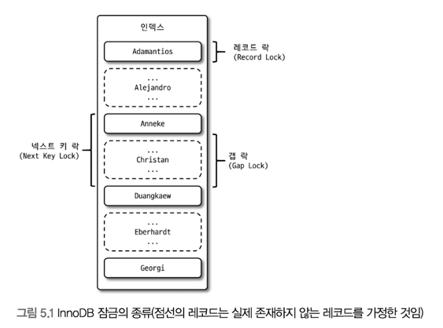

# InnoDB 스토리지 엔진 잠금
스토리지 엔진 내부에서 레코드 기반 잠금 방식을 탑재.MyISAM보다 훨씬 뛰어난 동시성 처리를 제공할 수 있지만, 이원화된 잠금 처리 탓에 잠금에 관련된 정보는 MySQL 명령을 이용해 접근하기 상당히 까다롭다.

InnoDB의 잠금 정보를 진단할 수 있는 도구
- lock_monitor(innodb_lock_monitor라는 이름의 InnoDB 테이블을 생성해서 InnoDB의 잠금 정보를 덤프하는 방법)
- SHOW ENGINE INNODB STATUS

두 방법이 전부였지만 최근 버전에선
InnoDB 트랜잭션과 잠금, 잠금 대기 중인 트랜잭션의 목록을 조회할 수 있는 방법이 도입됨.
information_schema.INNODB_TRX,INNODB_LOCKS,INNODB_LOCK_WAITS 라는 테이블을 조인 후 조회하면 현재 어떤 트랜잭션이 어떤 잠금을 대기하고 있고, 해당 잠금을 어느 트랜잭션이 가지고 있는지 확인 가능하며, 또한 장시간 잠금을 가지고 있는 클라이언트를 찾아서 종료시킬 수도 있다. Performance Schema를 이용해 InnoDB 내부 잠금(세마포어)에 대한 모니터링 방법도 추가됨.

레코드 락이 페이지 락으로, 또는 테이블 락으로 레벨업되는 경우 (락 에스컬레이션)는 존재하지 않음.
일반 상용 DBMS와는 조금 다르게 InnoDB 엔진에선 레코드 락 뿐만이 아니라 레코드와 레코드 사이의 간격을 잠그는 갭(GAP) 락 이라는 것이 존재.

1. 레코드 락

레코드 자체만 잠그는 락. InnoDB는 레코드 자체가 아니라 인덱스의 레코드를 잠근다는 차이가 있음. 인덱스가 없는 테이블이더라도 내부적으로 자동 생성된 클러스터 인덱스를 이용해 잠금 설정. PK, UK 인덱스에 의한 변경 작업에서는 gap에 대해선 잠그지 않고 레코드 자체에 대해서만 락을 건다.

2. 갭 락

다른 DBMS와의 차이는 Gap lock이 있다. 레코드 자체가 아니라 레코드와 바로 인접한 레코드 사이의 간격만을 잠그는 것을 의미. 레코드와 레코드 사이의 간격에 새로운 레코드가 INSERT 되는 것을 제어하는 것. 갭 락은 그 자체보단 이어서 설명할 넥스트 키 락의 일부로 자주 사용됨.

3. 넥스트 키 락

레코드 락과 갭 락을 합쳐 놓은 형태의 잠금.
STATEMENT 포맷의 바이너리 로그를 사용하는 MySQL 서버에선 REPEATABLE READ 격리 수준을 사용해야 한다. 또한 innodb_locks_unsafe_for_binlog 시스템 변수가 비활성화(0)되면 변경을 위해 검색하는 레코드엔 넥스트 키 락 방식으로 잠금이 걸림.
InnoDB의 갭 락이나 네긋트 키 락은 바이너리 록에 기록되는 쿼리가 레플리카 서버에서 실행될 때 소스 서버에서 만들어 낸 결과와 동일한 결과를 만들어 내도록 보장하는 것이 주 목적.
그러나 의외로 넥스트 키 락과 갭 락으로 인한 데드락이 발생하거나, 다른 트랜잭션을 기다리게 만드는 일이 자주 발생함.
가능하다면 바이너리 로그 포멧을 ROW 형태로 바꿔서 넥스트 키 락이나 갭 락을 줄이는 것이 좋다.

4. 자동 증가 락

자동 증가 값 추출(채번) 하기 위한 AUTO_INCREMENT의 경우 테이블에 동시에 여러 레코드가 INSERT 되는 경우, 저장되는 각 레코드는 중복되지 않고 저장된 순서대로 증가하는 일련번호 값을 가져야 한다.
내부적으로 AUTO_INCREMENT 테이블 수준의 락을 사용.

INSERT, REPLACE 쿼리에선 걸리지만 UPDATE, DELETE 등의 쿼리에선 걸리지 않는다. 트랜잭션 관계 없이 INSERT, REPLACE 문장에서 값을 가져오는 순간만 락이 걸렸다가 즉시 해제됨.
5.1버전 부터는 innodb_autoinc_lock_mode 라는 시스템 변수를 사용해 자동 증가 락 작동 방식을 변경 가능.

- innodb_autoinc_lock_mode=0
위 설명과 동일
- innodb_autoinc_lock_mode=1
단순 한 건 또는 여러 건의 레코드를 INSERT 하는 SQL 중 MySQL 서버가 INSERT 되는 레코드의 건수를 정확히 예측 가능한 때엔 자동 증가 락을 사용하지 않고, 훨씬 가볍고 빠른 래치(뮤텍스)를 이용해 처리.
개선된 래치는 자동 증가 락과 달리 아주 짧은 시간 동안만 잠금을 걸고, 처리 후 해제.
하지만, INSERT ... SELECT와 같이 건수를 (쿼리 실행 전) 예측할 수 없을 땐 0일때와 마찬가지로 자동 증가 락 사용.
  연속 모드(Consecutive mode)라고도 함.
- innodb_autoinc_lock_mode=2
자동 증가 락을 걸지 않고, 경량화된 래치(뮤텍스)를 사용.
하지만 하나의 INSERT 문장으로 INSERT되는 레코드라 하더라도, 연속된 자동 증가 값을 보장하진 않는다. (Interleaved mode)
  INSERT ... SELECT와 같은 대량 INSERT가 실행되는 중에도 다른 커넥션에서 INSERT를 수행할 수 있으므로 동시 처리 성능이 높아지지만, 자동 증가 값이 유니크한 값이 생성된다는 것만 보장. STATEMENT 포맷의 바이너리 로그를 사용하는 복제에선 소스 서버와 레플리카 서버의 자동 증가 값이 달라질 수 있기 때문에 주의.
