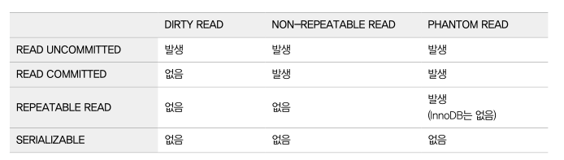
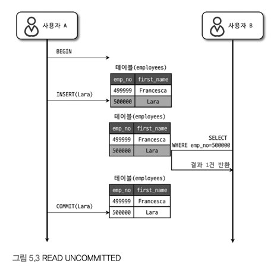

# 트랜잭션 격리 수준 (isolation level)
여러 트랜잭션이 동시에 처리될 때 특정 트랜잭션이 다른 트랜잭션에서 변경하거나 조회하는 데이터를 볼 수 있게 허용할지 말지를 결정하는 것.
크게 다음 4가지로 나눠지며, DIRTY READ라고도 하는 READ UNCOMMITTED는 일반적인 데이터베이스에선 거의 사용하지 않고, 
SERIALIZABLE 또한 동시성이 중요한 DB에선 거의 사용되지 않는다.
뒤로 갈수록 각 트랜잭션 간의 데이터 격리(고립) 정도가 높아지며, 동시 처리 성능도 떨어지는 것이 일반적.

격리 수준이 높아질수록 MYSQL 서버의 처리 성능이 많이 떨어질 것으로 생각하지만, SERIALIZABLE 격리 수준이 아니라면 크게 성능 개선이나 저하는 발생하지 않는다.

DB 격리 수준을 얘기하면 항상 언급되는 세 가지 부정합의 문제점이 있다. 부정합의 문제는 격리 수준의 레벨에 따라 발생할 수도, 발생하지 않을 수도 있다.

SQL-92, SQL-99 표준에 따르면  REPEATABLE READ 격리 수준에선 PHANTOM READ가 발생할 수 있지만, InnoDB에선 독특한 특성 때문에 PHANTOM READ가 발생하지 않는다.
일반적 서비스에선 READ COMMITTED와 REPEATABLE READ 중 하나를 사용.
오라클의 경우 READ COMMITED 수준을 많이 사용, MySQL에선 REPEATABLE READ를 주로 사용.
예제는 모두 AUTOCOMMIT OFF

## READ UNCOMMITTED

