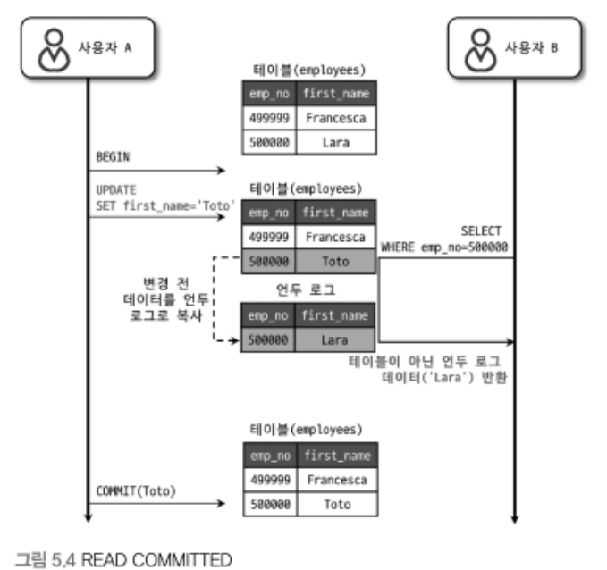
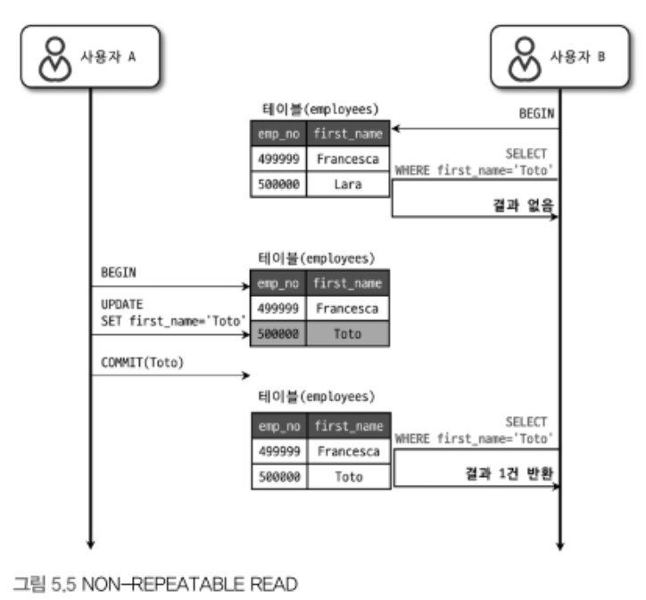
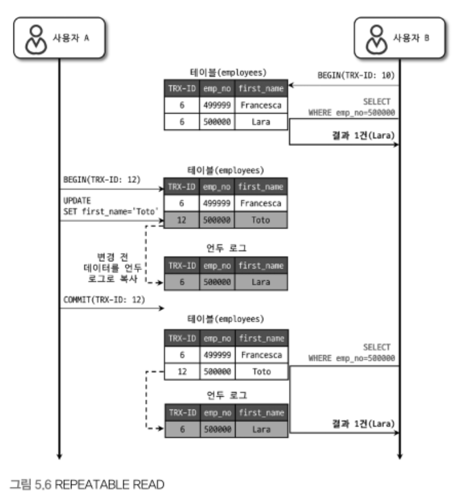
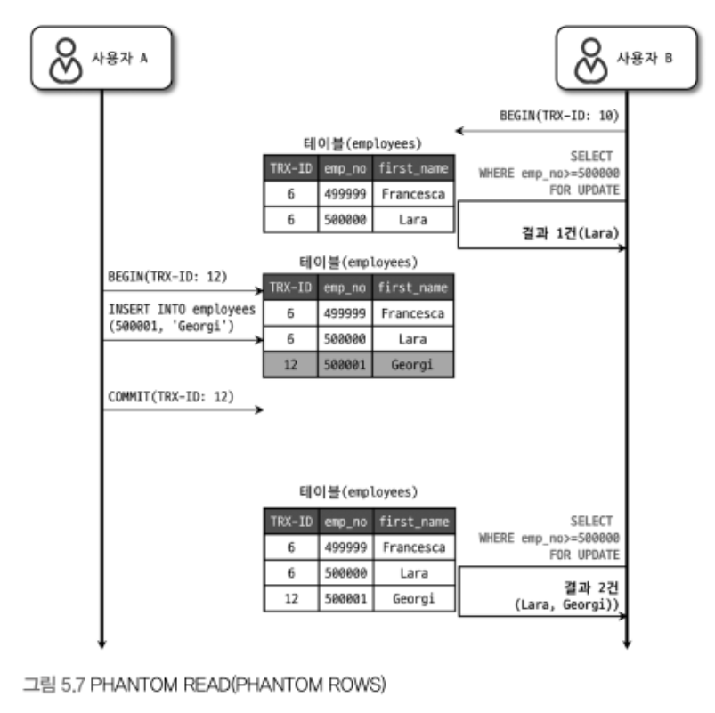

# 트랜잭션 격리 수준 (isolation level)
여러 트랜잭션이 동시에 처리될 때 특정 트랜잭션이 다른 트랜잭션에서 변경하거나 조회하는 데이터를 볼 수 있게 허용할지 말지를 결정하는 것.
크게 다음 4가지로 나눠지며, DIRTY READ라고도 하는 READ UNCOMMITTED는 일반적인 데이터베이스에선 거의 사용하지 않고, 
SERIALIZABLE 또한 동시성이 중요한 DB에선 거의 사용되지 않는다.
뒤로 갈수록 각 트랜잭션 간의 데이터 격리(고립) 정도가 높아지며, 동시 처리 성능도 떨어지는 것이 일반적.

격리 수준이 높아질수록 MYSQL 서버의 처리 성능이 많이 떨어질 것으로 생각하지만, SERIALIZABLE 격리 수준이 아니라면 크게 성능 개선이나 저하는 발생하지 않는다.

DB 격리 수준을 얘기하면 항상 언급되는 세 가지 부정합의 문제점이 있다. 부정합의 문제는 격리 수준의 레벨에 따라 발생할 수도, 발생하지 않을 수도 있다.

SQL-92, SQL-99 표준에 따르면  REPEATABLE READ 격리 수준에선 PHANTOM READ가 발생할 수 있지만, InnoDB에선 독특한 특성 때문에 PHANTOM READ가 발생하지 않는다.
일반적 서비스에선 READ COMMITTED와 REPEATABLE READ 중 하나를 사용.
오라클의 경우 READ COMMITED 수준을 많이 사용, MySQL에선 REPEATABLE READ를 주로 사용.
예제는 모두 AUTOCOMMIT OFF

## READ UNCOMMITTED

각 트랜잭션에서의 변경 내용이 COMMIT이나 ROLLBACK 여부에 상관없이 다른 트랜잭션에서 보인다.
사용자 A는 emp_no가 500000이고 first_name이 Lara인 사원을 INSERT.
변경된 내용을 커밋하기도 전에 사용자 B는 emp_no=500000인 사원을 검색.
이 경우 사용자 B는 COMMIT되지 않은 상태라도 조회가 가능.
But, 사용자 A가 Rollback 한다고 하더라도 사용자 B는 Lara가 정상 사원이라 생각하고 계속 처리하는 문제점 발생.
이를 Dirty read라 하고, 이를 허용하는 격리 수준이 READ UNCOMMITTED. 또한 RDBMS표준에선 트랜잭션의 격리 수준으로 인정하지 않을 정도로 정합성에 문제가 많은 격리 수준.

MySQL을 사용한다면 최소한 READ COMMITTED 이상의 격리 수준을 사용할 것을 권장.

## READ COMMITTED

오라클 DBMS에서 기본으로 사용되는 격리 수준. 온라인 서비스에서 가장 많이 선택되는 격리 수준.
Dirty read는 발생하지 않으며, 어떤 트랜잭션에서 데이터를 변경했더라도 COMMIT이 완료된 데이터만 다른 트랜잭션에서 조회할 수 있음.

사용자 A는 emp_no=500000 사원의 first_name을 Lara에서 Toto로 변경했는데, 이때 새로운 값인 Toto는 employees 테이블에 즉시 기록되고 이전 값인 Lara는 언두 영역으로 백업된다.
사용자 B는 first_name 컬럼의 값이 Lara로 조회되며, 언두 영역에 백업된 레코드를 가져온 것.

READ COMMITTED 격리 수준에서도 "NON-REPEATABLE READ"("REPEATABLE READ"가 불가능)라는 부정합 문제가 있다.

처음 사용자 B가 BEGIN 명령으로 트랜잭션을 시작하고 first_name이 "Toto"인 사용자를 검색했는데 결과값은 없는 상태.
사용자 A가 Toto로 변경 후 커밋하고 사용자 B가 똑같은 쿼리를 날리면 1건이 조회됨.
이를 REPEATABLE READ 정합성에 어긋난다고 한다.

동일 데이터를 여러 번 읽고 변경하는 작업이 금전적인 처리와 연결되면 문제가 될 수있다는 것.

## REPEATABLE READ
MySQL의 InnoDB 스토리지 엔진에서 기본적으로 사용되는 격리 수준.
바이너리 로그를 가진 MySQL서버에선 최소 REPEATABLE READ 격리 수준 이상을 사용해야 한다.

NON-REPEATABLE READ 부정합이 발생하지 않는다. 트랜잭션이 ROLLBACK될 가능성에 대비해 변경되기 전 레코드를 언두(Undo) 공간에 백업해두고 실제 레코드 값을 변경한다.
이러한 변경 방식은 MVCC(Multi Version Concurrency Control)라고 하며, COMMIT되기 전의 데이터를 보여준다.

모든 InnoDB의 트랜잭션은 고유한 트랜잭션 번호(순차적으로 증가하는 값)을 가지며, 언두 영역에 백업된 모든 레코드엔 변경을 발생시킨 트랜잭션 번호가 포함됨.
그리고 불필요하다고 판단한 시점에 주기적으로 삭제된다. 

REPEATABLE READ 격리 수준에서도 다음과 같은 부정합이 발생할 수 있다.
사용자 A가 INSERT를 실행하는를 도중 B가 SELECT ... FOR UPDATE 쿼리로 테이블을 조회했을 때 어떤 결과를 가져오는지 보여준다.

사용자 B는 BEGIN 명령으로 트랜잭션을 실행 후 SELECT를 수행.
두번째 SELECT하는 결과는 2건 리턴되므로 결과가 다른것을 알 수 있다.
이렇게 다른 트랜잭션에서 수행한 변경 작업에 의해 레코드가 보였다 안보였다 하는 현상을 PHANTOM READ 라고 한다.
SELECT ... FOR UPDATE 쿼리는 SELECT하는 레코드에 쓰기 잠금을 걸어야 하는데, 언두 레코드엔 잠금을 걸 수 없다.
그래서 SELECT ... FOR UPDATE나 SELECT ... LOCK IN SHARE MODE로 조회되는 레코드는 언두 영역의 변경 전 데이터를 가져오는 것이 아니라 현재 레코드의 값을 가져오게 되는 것.

## SERIALIZABLE
가장 단순한 격리 수준이면서 가장 엄격한 격리 수준. 그러므로 성능도 떨어지게 된다.
InnoDB에서 기본적으로 순수한 SELECT 작업은 아무런 레코드 잠금도 설정하지 않고 실행됨.Non-locking consistent read(잠금이 필요 없는 일관된 읽기)라는 말이 이를 의미하는 것.
하지만 격리 수준이 SERIALIZABLE로 설정되면 읽기 작업도 공유 잠금(읽기 잠금)을 획득해야만 하며, 동시에 다른 트랜잭션은 그러한 레코드를 변경하지 못하게 된다.
PHANTOM READ 문제가 발생하지 않지만, InnoDB에선 갭 락과 넥스트 키 락 덕분에 REPEATABLE READ 격리 수준에서도 이미 PHANTOM READ가 발생하지 않기 때문에 굳이 SERIALIZABLE을 사용할 필요는 없다.

> SELECT ... FOR UPDATE 또는 SELECT ... FOR SHARE 쿼리의 경우 PHANTOM READ 현상이 발생할 수 있다.
> 하지만 레코드 변경 이력(언두 레코드)에 잠금을 걸 수는 없기 때문에, 이러한 잠금을 동반한 SELECT 쿼리는 예외적인 상황

