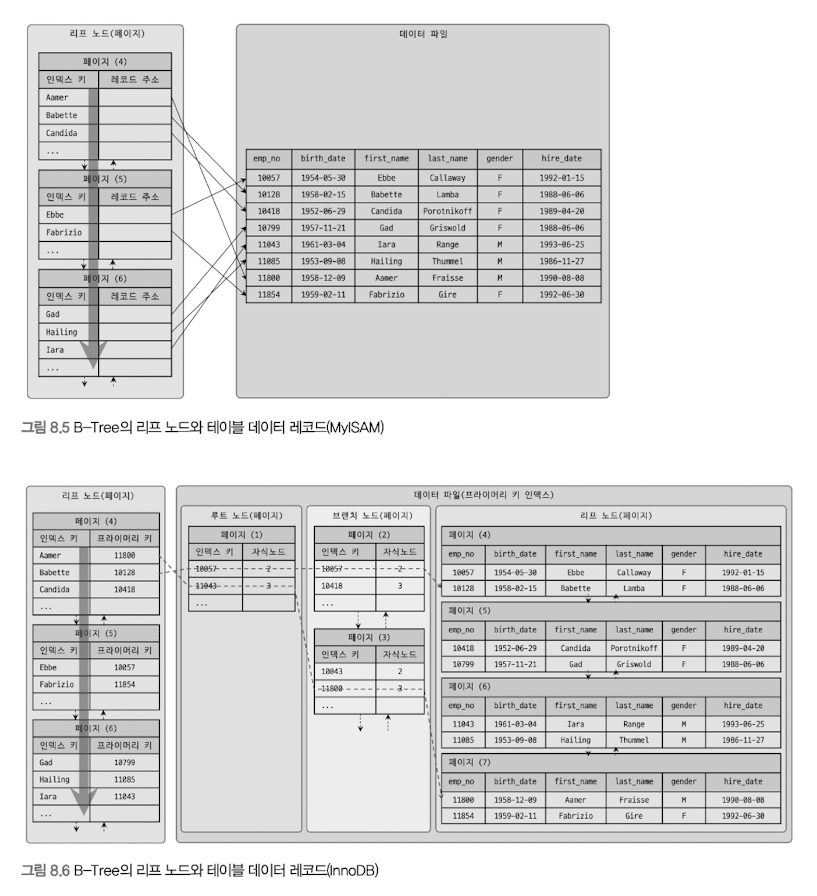

# 8.3 B-Tree 인덱스
인덱싱 알고리즘 중 가장 일반적으로 사용. 여러 가지 형태의 변형 알고리즘이 존재.
DBMS에선 주로 B+-Tree 또는 B-Tree가 사용된다.
B-Tree의 B는 Balanced를 의미한다.
원래 값을 변형시키지 않고, 인덱스 구조체 내에서는 항상 정렬된 상태로 유지함.

## 8.3.1 구조 및 특성
B-Tree 트리 구조의 최상위에 하나의 Root node가 존재하고, 그 하위에 자식 노드가 붙어있는 형태.
트리 구조의 가장 하위에 있는 노드를 Leaf node 라 하고, 중간의 노드를 Branch node 라고 한다.
인덱스와 실제 데이터가 저장된 데이터는 따로 관리되는데, 인덱스의 리프 노드는 항상 실제 데이터 레코드를 찾아가기 위한 주솟값을 가지고 있다.

인덱스는 테이블의 키 컬럼만 가지고 있으므로 나머지 컬럼을 읽으려면 데이터 파일에서 해당 레코드를 찾아야 한다. 이를 위해 인덱스의 리프 노드는 데이터 파일에 저장된 레코드의 주소를 가진다.

8.5는 MyISAM 테이블의 인덱스와 데이터 파일의 관계를 보여줌.
레코드 주소는 테이블의 생성 옵션에 따라 레코드가 테이블에 INSERT 된 순번이거나 데이터 파일 내의 위치(Offset).
8.6은 InnoDB 테이블의 인덱스의 데이터 파일의 관계를 보여줌.
프라이머리 키가 ROWID 역할을 한다.
두 엔진의 인덱스에서 가장 큰 차이는, 세컨더리 인덱스를 통해 데이터 파일의 레코드를 찾아가는 방법에 있다.
MyISAM 테이블은 세컨더리 인덱스가 물리적인 주소를 가지는 반면, InnoDB 테이블은 프라이머리 키를 주소처럼 사용하기 때문에 논리적인 주소를 가짐.

InnoDB 스토리지 엔진에선 모든 세컨더리 인덱스 검색에서 데이터 레코드를 읽기 위해선 반드시 프라이머리 키를 저장하고 있는 B-Tree를 다시 한 번 검색해야 한다.

두 엔진은 각각 장단점이 있지만 8.8에서 다시 설명.

## 8.3.2 B-Tree 인덱스 키 추가 및 삭제
추가 > 레코드의 키 값과 대상 레코드의 주소 정보를 리프 노드에 저장. 리프 노드가 꽉 차서 더는 없다면, 리프 노드가 Split(분리) 돼야 하는데, 이는 상위 브랜치 노드까지 처리 범위가 넓어진다.
이런 작업 탓에 쓰기 작업에 비용이 많이 들어감.
쓰기 작업(Insert, Update)의 Cost 계산 방법으로 일반 레코드 추가 작업을 1로 뒀을 때, 인덱스에 키를 추가하는 작업을 1.5로 예측.
테이블에 인덱스가 3개가 있다면, 하나도 없는 경우는 작업 비용이 1, 3개인 경우는 5.5 정도의 비용 (1.5 * 3 + 1) 정도로 예측한다.
비용은 메모리와 CPU에서 처리하는 시간이 문제가 아니라, 인덱스 페이지를 읽고 쓰기를 해야 해서 걸리는 시간이라는 점.

MyISAM이나 MEMORY 스토리지 엔진을 사용하는 테이블에선 INSERT 시 새로운 키 값을 B-Tree 인덱스에 변경한다. 하지만 InnoDB 스토리지 엔진은 더 지능적으로 필요하다면 인덱스 키 추가 작업을 지연시켜 나중에 처리할 수 있다. 하지만 프라이머리 키나, 유니크 인덱스의 경우 중복 체크가 필요하기 떄문에 즉시 B-Tree에 추가하거나 삭제.
체인지 버퍼에 대한 설명은 4.2.10절 참조.

삭제 > 리프노드를 찾아 그냥 삭제 마크만 하면 작업 완료.
이렇게 삭제 마킹된 인덱스 키 공간은 계속 방치하거나 재활용 가능. 이 작업 또한 디스크 I/O가 필요.

변경 > B-Tree의 키 값이 변경되는 경우 단순히 인덱스상의 키 값만 변경하는 것은 불가능. 먼저 키 값을 삭제한 후, 다시 새로운 키 값을 추가하는 형태로 처리.
InnoDB 엔진을 사용하는 테이블에 대해선 이 작업 모두 체인지 버퍼를 활용해 지연 처리될 수 있음.

검색 > 루트 노드부터 시작해 브랜치 노드를 거쳐 최종 리프 노드까지 이동하면서 비교 작업을 수행.
이 과정을 "트리 탐색"이라고 한다.
SELECT 뿐만 아니라 UPDATE, DELETE 처리에도 사용되며, 인덱스의 키 값에 변형이 가해진 후 비교되는 경우엔 절대 B-Tree의 빠른 검색  기능을 사용할 수 없다.
이는 인덱스에 존재하는 값이 아니기 떄문.

InnoDB 엔진에선 인덱스는 더 큰 의미를 가지고 있다.
레코드 잠금이나 넥스트 키락(갭락)이 검색을 수행한 인덱스를 잠근 후 테이블의 레코드를 잠그는 방식으로 구현돼 있다. 따라서 UPDATE, DELETE 문장이 실행될 때 테이블에 적절히 사용할 수 있는 인덱스가 없으면 불필요하게 많은 레코드를 잠근다.
심지어 테이블의 모든 레코드를 잠글 수도 있다. InnoDB에선 그만큼 인덱스 설계가 중요하고 많은 영향을 미침.

