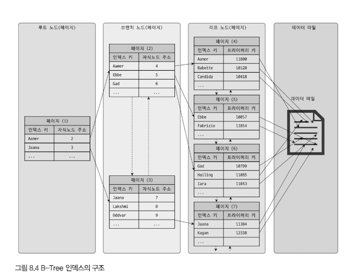
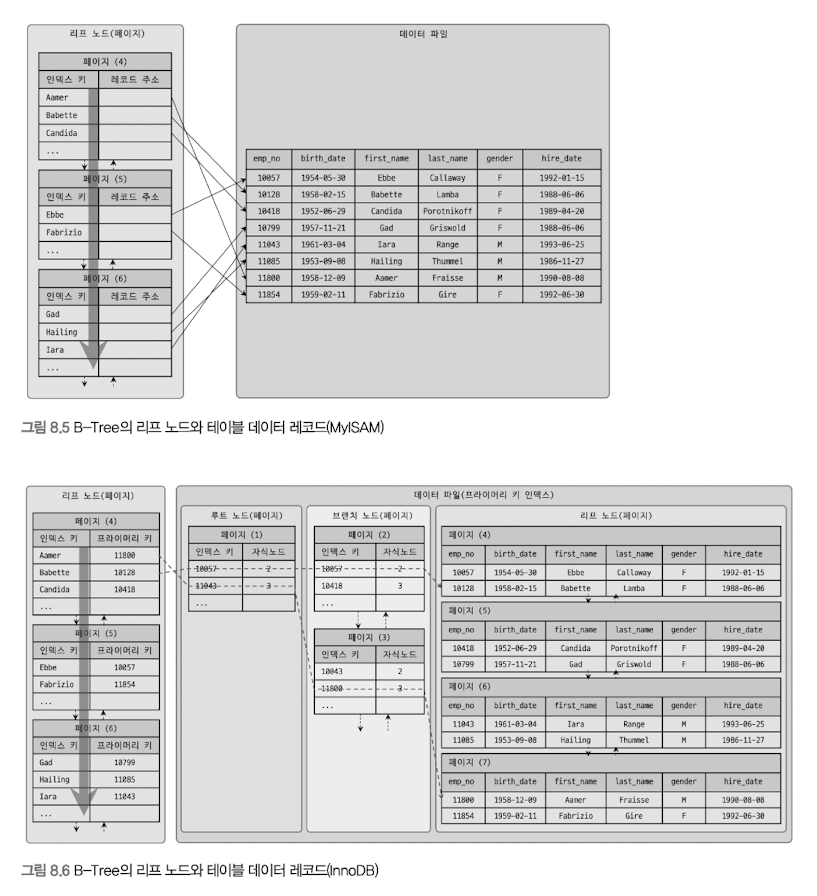
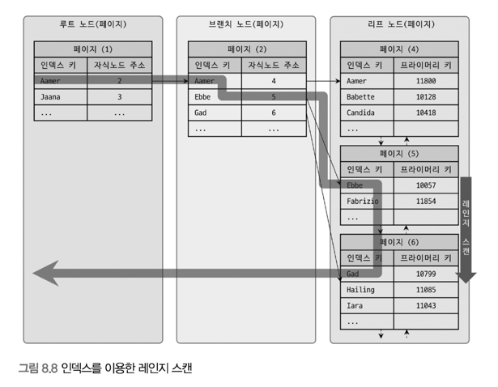
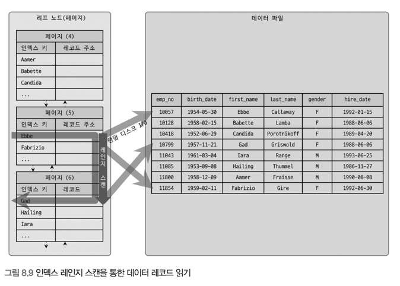
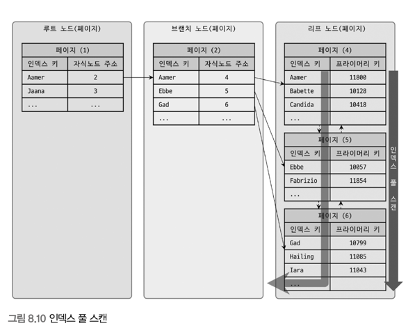
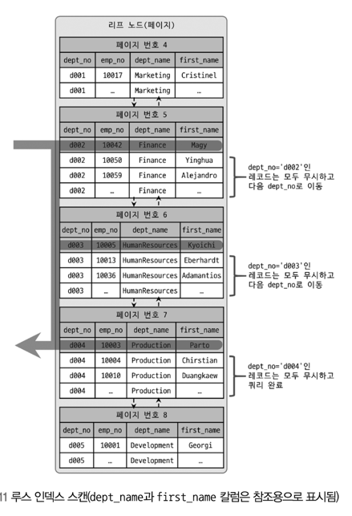
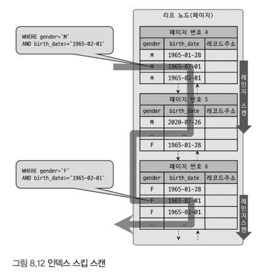
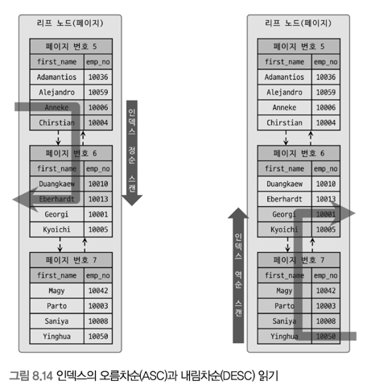
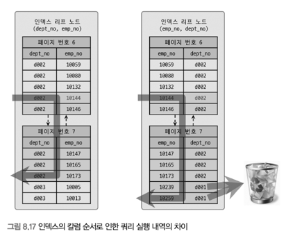

# 8.3 B-Tree 인덱스
인덱싱 알고리즘 중 가장 일반적으로 사용. 여러 가지 형태의 변형 알고리즘이 존재.
DBMS에선 주로 B+-Tree 또는 B-Tree가 사용된다.
B-Tree의 B는 Balanced를 의미한다.
원래 값을 변형시키지 않고, 인덱스 구조체 내에서는 항상 정렬된 상태로 유지함.

## 8.3.1 구조 및 특성
B-Tree 트리 구조의 최상위에 하나의 Root node가 존재하고, 그 하위에 자식 노드가 붙어있는 형태.
트리 구조의 가장 하위에 있는 노드를 Leaf node 라 하고, 중간의 노드를 Branch node 라고 한다.
인덱스와 실제 데이터가 저장된 데이터는 따로 관리되는데, 인덱스의 리프 노드는 항상 실제 데이터 레코드를 찾아가기 위한 주솟값을 가지고 있다.

인덱스는 테이블의 키 컬럼만 가지고 있으므로 나머지 컬럼을 읽으려면 데이터 파일에서 해당 레코드를 찾아야 한다. 이를 위해 인덱스의 리프 노드는 데이터 파일에 저장된 레코드의 주소를 가진다.

8.5는 MyISAM 테이블의 인덱스와 데이터 파일의 관계를 보여줌.
레코드 주소는 테이블의 생성 옵션에 따라 레코드가 테이블에 INSERT 된 순번이거나 데이터 파일 내의 위치(Offset).
8.6은 InnoDB 테이블의 인덱스의 데이터 파일의 관계를 보여줌.
프라이머리 키가 ROWID 역할을 한다.
두 엔진의 인덱스에서 가장 큰 차이는, 세컨더리 인덱스를 통해 데이터 파일의 레코드를 찾아가는 방법에 있다.
MyISAM 테이블은 세컨더리 인덱스가 물리적인 주소를 가지는 반면, InnoDB 테이블은 프라이머리 키를 주소처럼 사용하기 때문에 논리적인 주소를 가짐.

InnoDB 스토리지 엔진에선 모든 세컨더리 인덱스 검색에서 데이터 레코드를 읽기 위해선 반드시 프라이머리 키를 저장하고 있는 B-Tree를 다시 한 번 검색해야 한다.

두 엔진은 각각 장단점이 있지만 8.8에서 다시 설명.

## 8.3.2 B-Tree 인덱스 키 추가 및 삭제
추가 > 레코드의 키 값과 대상 레코드의 주소 정보를 리프 노드에 저장. 리프 노드가 꽉 차서 더는 없다면, 리프 노드가 Split(분리) 돼야 하는데, 이는 상위 브랜치 노드까지 처리 범위가 넓어진다.
이런 작업 탓에 쓰기 작업에 비용이 많이 들어감.
쓰기 작업(Insert, Update)의 Cost 계산 방법으로 일반 레코드 추가 작업을 1로 뒀을 때, 인덱스에 키를 추가하는 작업을 1.5로 예측.
테이블에 인덱스가 3개가 있다면, 하나도 없는 경우는 작업 비용이 1, 3개인 경우는 5.5 정도의 비용 (1.5 * 3 + 1) 정도로 예측한다.
비용은 메모리와 CPU에서 처리하는 시간이 문제가 아니라, 인덱스 페이지를 읽고 쓰기를 해야 해서 걸리는 시간이라는 점.

MyISAM이나 MEMORY 스토리지 엔진을 사용하는 테이블에선 INSERT 시 새로운 키 값을 B-Tree 인덱스에 변경한다. 하지만 InnoDB 스토리지 엔진은 더 지능적으로 필요하다면 인덱스 키 추가 작업을 지연시켜 나중에 처리할 수 있다. 하지만 프라이머리 키나, 유니크 인덱스의 경우 중복 체크가 필요하기 떄문에 즉시 B-Tree에 추가하거나 삭제.
체인지 버퍼에 대한 설명은 4.2.10절 참조.

삭제 > 리프노드를 찾아 그냥 삭제 마크만 하면 작업 완료.
이렇게 삭제 마킹된 인덱스 키 공간은 계속 방치하거나 재활용 가능. 이 작업 또한 디스크 I/O가 필요.

변경 > B-Tree의 키 값이 변경되는 경우 단순히 인덱스상의 키 값만 변경하는 것은 불가능. 먼저 키 값을 삭제한 후, 다시 새로운 키 값을 추가하는 형태로 처리.
InnoDB 엔진을 사용하는 테이블에 대해선 이 작업 모두 체인지 버퍼를 활용해 지연 처리될 수 있음.

검색 > 루트 노드부터 시작해 브랜치 노드를 거쳐 최종 리프 노드까지 이동하면서 비교 작업을 수행.
이 과정을 "트리 탐색"이라고 한다.
SELECT 뿐만 아니라 UPDATE, DELETE 처리에도 사용되며, 인덱스의 키 값에 변형이 가해진 후 비교되는 경우엔 절대 B-Tree의 빠른 검색  기능을 사용할 수 없다.
이는 인덱스에 존재하는 값이 아니기 떄문.

InnoDB 엔진에선 인덱스는 더 큰 의미를 가지고 있다.
레코드 잠금이나 넥스트 키락(갭락)이 검색을 수행한 인덱스를 잠근 후 테이블의 레코드를 잠그는 방식으로 구현돼 있다. 따라서 UPDATE, DELETE 문장이 실행될 때 테이블에 적절히 사용할 수 있는 인덱스가 없으면 불필요하게 많은 레코드를 잠근다.
심지어 테이블의 모든 레코드를 잠글 수도 있다. InnoDB에선 그만큼 인덱스 설계가 중요하고 많은 영향을 미침.

## 8.3.3 B-Tree 인덱스 사용에 영향을 미치는 요소
컬럼의 크기, 레코드의 건수, 유니크한 인덱스 키 값의 개수 등이 영향을 끼침.

1. 인덱스 키 값의 크기
2. B-Tree 깊이
직접 제어 방법은 없음
3. 선택도(기수성)
선택도 (Selectivity), 기수성(Cardinality)는 같은 의미로 사용되며, 모든 인덱스 키 값 가운데 유니크한 값의 수를 의미.
중복된 값이 많아질수록 기수성은 낮아지고, 선택도 또한 떨어짐.
선택도가 높을수록 검색 대상이 줄어들기 때문에 그만큼 빠르게 처리됨.

## 8.3.4 B-Tree 인덱스를 통한 데이터 읽기
MySQL이 인덱스를 이용하는 대표적 방법 세 가지
1. 인덱스 레인지 스캔

2. 인덱스 풀 스캔

3. 루스 인덱스 스캔

4. 인덱스 스킵 스캔

## 8.3.5 다중 컬럼(Multi-column) 인덱스

다중 컬럼 인덱스가 어떻게 정렬되는지 설명해준다.
이 그림에서 중요한 점은 인덱스의 두 번째 칼럼은 첫 번째 칼럼에 의존해서 정렬돼 있다는 것.
이는 첫번째 칼럼이 똑같은 레코드에서만 의미가 있다는 것.

## 8.3.6 B-Tree 인덱스의 정렬 및 스캔 방향
항상 오름차, 내림차 순으로 정렬되어 저장.
MySQL 5.7버전까지는 컬럼 단위로 정렬 순서를 혼합(ASC,DESC)해서 인덱스를 생성할수 없어 -1을 곱한 값을 저장하는 우회 방법을 사용했다.
8.0부턴 다음과 같은 정렬 순서를 혼합한 인덱스도 생성 가능
CREATE INDEX ix_teamname_userscore ON employees (team_name ASC, user_score DESC)

## 8.3.7 B-Tree 인덱스의 가용성과 효율성

### 8.3.7.1 비교 조건의 종류와 효율성

SELECT * FROM dept_emp
WHERE dept_no='d002' AND emp_no >= 10114;

case A : INDEX(dept_no, emp_no)
case B : INDEX(emp_no, dept_no)

case A는 dept_no='d002' AND emp_no >= 10114인 레코드를 찾고, 그 이후엔 dept_no가 'd002'가 아닐 때까지 인덱스를 그냥 쭉 읽기만 하면 됨.
case B는 emp_no >= 10114 AND dept_no='d002'인 레코드를 찾고, 그 이후엔 모든 레코드에 대해 dept_no가 'd002'인지 비교한다.

이처럼 인덱스를 통해 읽은 레코드가 나머지 조건에 맞는지 비교하면서 취사선택하는 작업을 '필터링'

위의 케이스에서 A는 범위를 좁히는데 도움이 됐지만, B는 도움이 되지 못했다.
A는 작업 범위 결정 조건, B는 필터링 조건, 체크 조건이라 표현.

### 8.3.7.2 인덱스의 가용성
B-Tree 인덱스의 특징은 왼쪽 값에 기준해서 오른쪽 값이 정렬돼 있다는 것. 단일 컬럼 인덱스는 물론 다중 컬럼 인덱스도 함께 적용.

case A : INDEX (first_name)
case B : INDEX (dept_no, emp_no)

SELECT * FROM employees WHERE first_name LIKE '%mer';

이 쿼리는 인덱스 레인지 스켄 방식으로 인덱스를 이용할 수 없다. %가 앞에 있기 때문에 왼쪽부터 찾을 수 없기 때문.

SELECT * FROM dept_emp WHERE emp_no >= 10144;

선행 컬럼인 dept_no 조건 없이 검색하기 때문에 효율적으로 검색 불가능.

### 8.3.7.2 인덱스의 가용성

다음 조건에선 B-Tree 인덱스 사용 불가.

- NOT-EQUAL로 비교된 경우 ("<>", "NOT IN", "NOT BETWEEN", "IS NOT NULL")
- LIKE %??(앞부분이 아닌 뒷부분 일치) 형태로 문자열 패턴이 비교된 경우
- 스토어드 함수나 다른 연산자로 인덱스 컬럼이 변형된 이후 비교된 경우
- NOT-DETERMINISTIC 속성의 스토어드 함수가 비교 조건에 사용된 경우
- 데이터 타입이 서로 다른 비교(인덱스 컬럼의 타입을 변환해야 비교가 가능한 경우)
- 문자열 데이터 타입의 콜레이션이 다른 경우
- 작업 범위 결정 조건으로 인덱스를 사용하지 못하는 경우
- 작업 범위 결정 조건으로 인덱스를 사용하는 경우(i는 2보다 크고 n보다 작은 임의의 값을 의미)

# 8.4 R-Tree 인덱스

