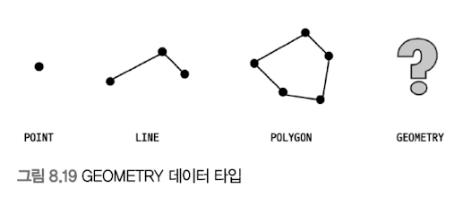
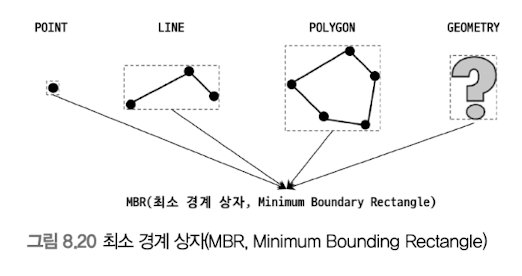
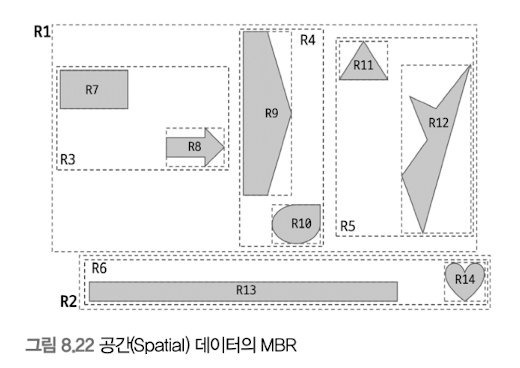
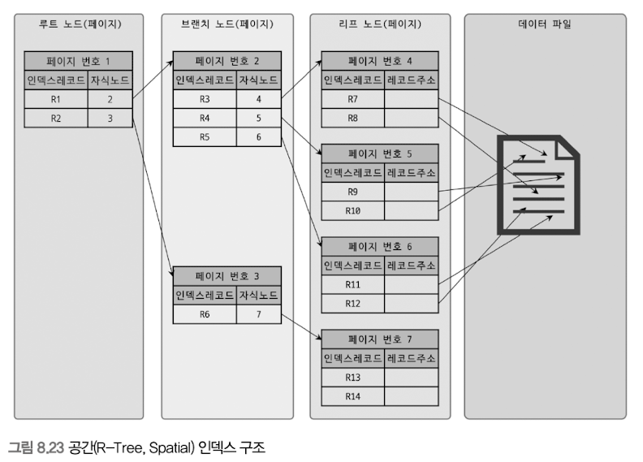
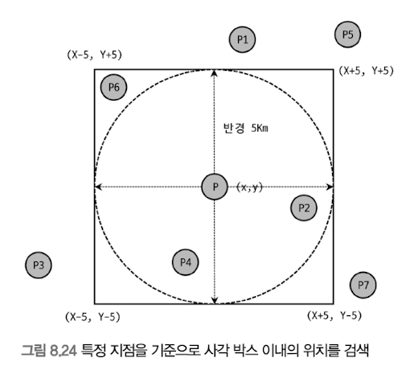

# 8.3 R-Tree 인덱스
공간 인덱스 (Spatial Index) - R-Tree 인덱스 알고리즘을 이용해 2차원의 데이터를 인덱싱하고 검색하는 목적의 인덱스.
기본 내부 메커니즘은 B-Tree와 흡사하나, B-Tree의 경우 컬럼의 값이 1차원의 스칼라 값인 반면,
R-Tree는 2차원의 공간 개념 값.

MySQL의 공간 확장(Spatial Extension)을 이용하면 간단하게 위치 기반 서비스 구현 가능.
- 공간 데이터를 저장할 수 있는 데이터 타입
- 공간 데이터의 검색을 위한 공간 인덱스(R-Tree 알고리즘)
- 공간 데이터의 연산 함수(거리 또는 포함 관계의 처리)

## 구조 및 특성
공간 정보의 저장 및 검색을 위해 기하학적 도형(Geometry) 정보를 관리할 수 있는 데이터 타입을 제공.



GEOMETRY 타입은 나머지 3개 타입의 슈퍼 타입으로, 세 객체 모두를 저장 가능.

MBR(Minimum Bounding Rectangle) - 해당 도형을 감싸는 최소 크기의 사각형 의미. 이 사각형들의 포함 관계는 B-Tree 형태로 구현한 인덱스가 R-Tree 인덱스.


MBR을 3개 레벨로 나눠서 그려보면 다음과 같다.
- 최상위 레벨 R1, R2
- 차상위 레벨 R3, R4, R5, R6
- 최하위 레벨 R7~14



최하위 레벨 MBR(각 도형을 제일 안쪽에서 둘러싼 점선 상자)은 도형 데이터의 MBR을 의미.
차상위 레벨 MBR은 중간 크기의 MBR(도형 객체의 그룹).
차상위 레벨 MBR은 R-Tree의 브랜치 노드가 된다.

각 도형의 객체는 리프 노드에 저장되므로, R-Tree 인덱스의 내부를 표현 가능.



## 인덱스의 용도
R-Tree(Rectangle), 공간(Spatial) 인덱스라고도 한다. 일반적으로 WGS84(GPS) 기준의 위도, 경도 좌표 저장에 주로 사용.
위도, 경도 뿐만 아니라 CAD/CAM 소프트웨어 또는 회로 디자인 등과 같이 좌표 시스템에 기반을 둔 정보에 대해서는 모두 적용 가능.

각 도형(더 정확히는 도형의 MBR)의 포함 관계를 이용해 만들어진 인덱스. 따라서 ST_Contains() 또는 ST_Within() 등과 같은 포함 관계를 비교하는 함수로 검색을 수행하는 경우에만 인덱스를 이용 가능.
대표적으로 '현재 사용자의 위치로부터 반경 5km 이내의 음식점 검색' 등과 같은 검색에 사용 가능. 현재 출시된 버전의 MySQL에선 거리를 비교하는 ST_Distance(), ST_Distance_Sphere() 함수는 공간 인덱스를 효율적으로 사용하지 못하기 때문에 공간 인덱스를 사용할 수 있는 ST_Contains() 또는 ST_Within()을 이용해 거리 기반의 검색을 해야 한다.



P를 기준으로 반경 5KM 내의 점들을 검색하기 위해선 사각 점선의 상자에 포함되는(ST_Contains() 또는 ST_Within() 함수 이용) 점들을 검색하면 된다.
ST_Contains() 또는 ST_Within() 연산은 사각형 박스와 같은 다각형(Polygon)으로만 연산할 수 있으므로 반경 5km를 그리는 원을 포함하는 최소 사각형(MBR)으로 포함 관계 비교를 수행한것.

P6은 MBR 안에 포함됐지만 5km 이상 떨어져 있다. P6을 제외하려면 복잡한 연산 필요.

```SQL
-- // ST_Contains() 또는 ST_Within()을 이용해 "사각 상자"에 포함된 좌표 Px만 검색
SELECT * FROM wb_location
WHERE ST_Contains(사각 상자, px);

SELECT * FROM wb_location
WHERE ST_Within(px, 사각 상자);


```

P6을 제거해야 한다면 다음과 같이 ST_Contains() 비교의 결과에 대해 ST_Distance_Sphere() 함수를 이용해 다시 한번 필터링해야 한다.

```SQL
SELECT * FROM tb_location
WHERE ST_Contains(사각상자, px)
AND ST_Distance_Sphere(p, px) <= 5*1000 /* 5km */
```

