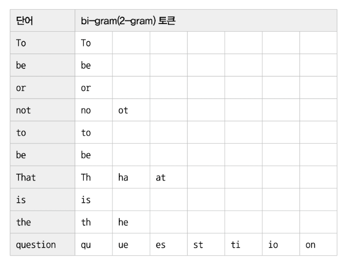

# 전문 검색 인덱스
지금까진 크지 않은 데이터를 다루는 인덱스 알고리즘. B-Tree 인덱스는 실제 컬럼 값이 1MB 이더라도 1,000byte(MyISAM) 또는 3072byte(InnoDB) 까지만 잘라 인덱스 키로 사용.
또한 좌측 일부 일치와 같은 검색만 가능.

전문(Full Text) 검색에는 B-Tree 인덱스를 사용할 수 없고, 문서 전체에 대한 분석, 검색을 위한 전문 검색(Full Text search) 인덱스를 사용해야함.

## 인덱스 알고리즘
문서 본문의 내용에서 사용자가 검색하게 될 키워드를 분석, 빠른 검색용으로 사용할 수 있게 이러한 키워드로 인덱스를 구축.
전문 검색 인덱스는 문서의 키워드를 인덱싱하는 기법에 따라 크게 단어의 어근 분석과 n-gram 분석 알고리즘으로 구분 가능.
예전엔 구분자(공백이나 일부 문장 기호를 기준으로 토큰을 분리)도 하나의 인덱싱 알고리즘처럼 생각됐지만, MySQL 8.0버전부턴 구분자 방식은 이미 어근 분석과 n-gram 알고리즘에 함께 포함.

### 어근 분석 알고리즘
전문 검색 인덱스는 다음 두 가지 중요한 과정을 거쳐 색인 작업이 수행.
- 불용어(Stop Word) 처리
별 가치가 없는 단어를 모두 필터링해서 제거하는 작업을 의미.
개수는 많지 않기 때문에 알고리즘을 구현한 코드에 모두 상수로 정의해서 사용하는 경우가 많고, 유연성을 위해 불용어 자체를 데이터베이스화해서 사용자가 추가하거나 삭제할 수 있게 구현하는 경우도 있음.
MySQL 서버는 불용어가 소스코드에 정의돼 있지만, 이를 무시하고 사용자가 별도로 불용어 정의가 가능

- 어근 분석(Stemming)
검색어로 선정된 단어의 뿌리인 원형을 찾는 작업. 오픈소스 형태소 분석 라이브러리인 MeCab을 플러그인 형태로 사용할 수 있게 지원. <br> 
한글이나 일본어의 경우 영어와 같이 단어의 변형 자체는 거의 없기 때문에, 어근 분석보단 문장의 형태소를 분석해서 명사와 조사를 구분하는 기능이 더 중요한 편. <br>
MeCab은 일본어를 위한 형태소 분석 프로그램이며, 서구권 언어를 위한 형태소 분석기는 MongoDB에서 사용되는 Snowball이라는 오픈소스가 있다. <br>
중요한 것은 각 국가의 언어가 서로 문법이 다르고, 다른 방식으로 발전해 왔기 때문에 형태소 분석이나 어근 분석 또한 언어별로 방식이 모두 다르다는 것. 그나마 한국어는 일본어와 많이 닮았기 때문에 MeCab을 이용해 한글 분석이 가능.

MeCab을 제대로 작동하게 하려면 단어 사전이 필요하며, 문장을 해체해서 각 단어의 품사를 식별할 수 있는 문장의 구조 인식이 필요. 문장의 구조 인식을 위해선 실제 언어의 샘플을 이용해 언어를 학습하는 과정이 필요하다. 
MeCab을 적용하는 방법은 어렵지 않지만, 한글에 맞게 완성도를 갖추는 작업은 많은 시간과 노력이 필요.

### n-gram 알고리즘
MeCab은 전문적인 검색 엔진을 고려하는 것이 아니라면 범용적으로 적용하기는 쉽지 않다. 이런 단점을 보완하기 위해 n-gram 알고리즘이 도입됨.
n-gram은 단순히 키워드를 검색해내기 위한 인덱싱 알고리즘.

n-gram이란? 본문을 무조건 몇 글자씩 잘라서 인덱싱하는 방법.
형태소 분석보단 알고리즘이 단순하고 국가별 언어에 대한 이해와 준비 작업이 필요 없는 반면, 만들어진 인덱스의 크기는 상당히 큰 편.
n-gram에서 n은 인덱싱할 키워드의 최소 글자 수를 의미. 일반적으로 2글자 단위로 키워드를 쪼개서 인덱싱하는 2-gram(또는 Bi-gram) 방식이 많이 사용됨.

> To be or not to be. That is the question

다음 단어는 띄어쓰기와 마침표를 기준으로 10개의 단어로 구분되고, 2글자씩 중첩해서 토큰으로 분리됨.
주의할 점은 각 글자가 중첩해서 2글자씩 토큰으로 구분됐다는 것.

그래서 10글자 단어라면 그 단어는 2-gram 알고리즘에선 (10-1)개의 토큰으로 구분됨. 이렇게 구분된 각 토큰을 인덱스에 저장하기만 하면 된다.
이때 중복된 토큰은 하나의 인덱스 엔트리로 병합되어 저장됨.



이렇게 생성된 토큰들에 대해 불용어를 걸러내는 작업을 수행하는데, 이때 불용어와 동일하거나 불용어를 포함하는 경우 걸러서 버린다.

다음과 같이 information_schema.innodb_ft_default_stopword 테이블을 통해 확인 가능.

> SELECT * FROM information_schema.INNODB_FT_DEFAULT_STOPWORD;

전문검색을 더 빠르게 하기 위해 2단계 인덱싱(프론트엔드와 백엔드 인덱스)과 같은 방법도 있지만, MySQL 서버는 이렇게 구분된 토큰을 단순한 B-Tree 인덱스에 저장한다.
성능 향상을 위한 Merge-Tree 같은 기능을 가지고 있긴 하지만 이하 생략

### 불용어 변경 및 삭제
ti, at, ha 같은 토큰들은 a와 i 철자가 불용어로 등록돼 있기 때문에 모두 걸러져서 버려졌다.
이 같은 불용어 처리는 사용자에게 도움이 되기보단 사용자를 더 혼란스럽게 하는 기능일 수 있다.
불용어 처리 자체를 완전히 무시하거나, MySQL 서버에 내장된 불용어 대신 사용자가 직접 불용어를 등록하는 방법을 권장.

#### 전문 검색 인덱스의 불용어 처리 무시
MySQL 서버의 모든 전문 검색 인덱스에 대해 불용어를 완전히 제거하는 것.
my.cnf 파일의 ft_stopword_file 시스템 변수에 빈 문자열을 설정하면 된다.
> ft_stopword_file=''

ft_stopword_file 변수에 직접 불용어 목록을 적용할 수도 있다.

전문 검색 인덱스에 대해서만 불용어 처리를 무시하는 것도 가능. innodb_ft_enable_stopword 시스템 변수를 OFF로 설정하면 된다.

> SET GLOBAL innodb_ft_enable_stopword=OFF;

#### 사용자 정의 불용어 사용

1. 첫번째 방법
> ft_stopword_file='/data/my_custom_stopword.txt'

2. 두번째 방법
InnoDB 스토리지 엔진을 사용하는 테이블 전문 검색 엔진에서만 사용 가능. 불용어의 목록을 테이블로 저장하는 방식.
다음과 같이 불용어 테이블을 생성하고, innodb_ft_server_stopword_table 시스템 변수에 테이블을 설정하면 된다.<br>
불용어 목록을 변경한 이후 전문 검색 인덱스가 생성돼야만 불용어가 적용됨.
```SQL
CREATE TABLE my_stopword(value VARCHAR(30)) ENGINE = INNODB;
INSERT INTO my_stopword(value) VALUES ('MySQL');

SET GLOBAL innodb_ft_server_stopword_table = 'mydb/my_stopword';
    
ALTER TABLE tb_bi_gram
ADD FULLTEXT INDEX fx_title_body(title, body) WITH PARSER ngram;
```

## 전문 검색 인덱스의 가용성
사용을 위해선 다음 두 조건을 갖춰야함.
- 쿼리 문장이 전문 검색을 위한 문법(MATCH ... AGAINST ...)을 사용
- 테이블이 전문 검색 대상 컬럼에 대해서 전문 인덱스 보유

다음 쿼리는 풀 테이블 스캔으로 쿼리를 처리.
> SELECT * FROM tb_test WHERE doc_body LIKE '%애플%';

전문 검색 인덱스를 사용하려면 반드시 다음 예제와 같이 MATCH (...) AGAINST (...) 구문으로 검색 쿼리를 작성해야 하며, 
전문 검색 인덱스를 구성하는 컬럼들은 MATCH 절의 괄호 안에 모두 명시돼야 한다.

> SELECT * FROM tb_test
> WHERE MATCH(doc_body) AGAINST('애플' IN BOOLEAN MODE);


