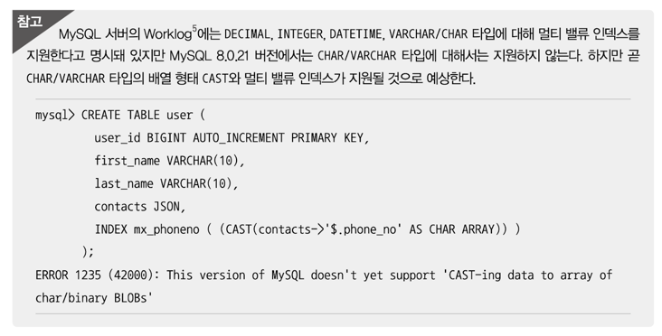

# 멀티 벨류 인덱스
하나의 데이터 레코드가 여러 개의 키 값을 가질 수 있는 형태의 특별한 인덱스.
RDBMS를 기준으로 생각하면 이러한 인덱스는 정규화에 위배되는 형태. 하지만 최근 RDBMS들이 JSON 데이터 타입을 지원하기 시작하면서 JSON의 배열 타입의 필드에 저장된 원소(Element)들에 대한 인덱스 요건이 발생한 것이다.

json 포멧으로 데이터를 저장하는 MongoDB는 처음부터 이런 형태의 인덱스를 지원하고 있었지만 MySQL Server는 멀티 벨류 인덱스에 대한 지원 없이 JSON 타입 컬럼만 지원했었으나, 8.0 버전에서 지원하도록 기능이 추가됨.

```sql
CREATE TABLE user(
    user_id BIGINT,
    first_name VARCHAR(10),
    last_name VARCHAR(10),
    credit_info JSON,
    INDEX mx_creditscores ( (CAST(credit_info -> '$.credit_scores' AS UNSIGNED ARRAY)) )
);

INSERT INFO user VALUES (1, 'Matt','Lee','{"credit_scores":[360,353,351]}');
```
멀티 벨류 인덱스를 활용하기 위해선 반드시 다음 함수들을 이용해서 검색해야 옵티마이저가 인덱스를 활용한 실행 계획을 수립.
- MEMBER OF()
- JSON_CONTAINS()
- JSON_OVERLAPS()

```sql
SELECT * FROM user WHERE 360 MEMBER OF (credit_info->'$.credit_scores');
EXPLAIN SELECT * FROM user WHERE 360 MEMBER OF (credit_info->'$.credit_scores');
```

