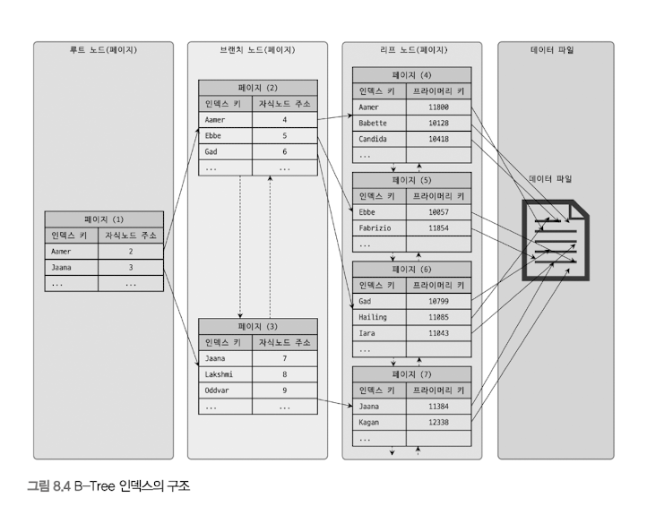

# 클러스터링 인덱스
테이블의 레코드를 비슷한 것(PK 기준)들끼리 묶어서 저장하는 형태로 구현.
비슷한 값들을 동시에 조회하는 경우가 많다는 점에 착안한 것.
InnoDB 스토리지 엔진에서만 지원하며, 나머지는 지원되지 않는다.

테이블의 PK에 대해서만 적용되는 내용. PK 값이 비슷한 레코드끼리 묶어서 저장하는 것을 클러스터링 인덱스라고 표현한다.
여기서 중요한 것은 PK 값에 의해 레코드의 저장 위치가 결정된다는 것.
또한 PK 값이 변경되면 그 레코드의 물리적 저장 위치가 바뀌어야 한다는 것을 의미하기도 한다.
테이블의 PK 값 자체에 대한 의존도가 상당히 크기 떄문에 신중히 PK를 결정해야 함.

이러한 특성 때문에 사실 인덱스 알고리즘이라기 보단 테이블 레코드의 저장 방식이라고 볼 수 있다. 그래서 "클러스터링 인덱스"와 "클러스터링 테이블"은 동의어로 사용하기도 한다.
또한 클러스터링 기준이 되는 PK는 클러스터링 키라고도 표현.
InnoDB와 같이 항상 클러스터링 인덱스로 저장되는 테이블은 PK 기반의 검색이 매우 빠르며, 대신 레코드의 저장이나 PK 변경이 상대적으로 느리다.

> 일반적으로 B-Tree 인덱스도 인덱스 키 값으로 이미 정렬되어 저장된다. 클러스터링 인덱스와 차이점은 테이블 레코드가 PK 값으로 정렬되어 저장된 경우만.


B-Tree와 비슷하지만, 세컨더리 인덱스를 위한 B-Tree 리프 노드와는 달리 레코드의 모든 컬럼이 같이 저장돼 있음을 알 수 있다. 이는 테이블 그 자체가 하나의 거대한 인덱스 구조로 관리된다는 것.



```sql
UPDATE tb_test SET emp_no = 100002 WHERE emp_no=100007;
```


> MyISAM 테이블이나 기타 InnoDB를 제외한 테이블의 데이터 레코드는 PK나 인덱스 키 값이 변경된다고 해서 실제 데이터 레코드 위치가 변경되지 않는다. 데이터 레코드가 INSERT 될 때 데이터 파일의 끝(또는 임의의 빈 공간)에 저장된다.
> 이렇게 한 번 결정된 위치는 절대 바뀌지 않고, 저장된 주소는 MySQL 내부적으로 레코드를 식별하는 아이디로 인식됨. 레코드가 저장된 주소를 ROW-ID라고 표현하며, 일부 DBMS에선 이 값을 사용자가 직접 조회하거나 쿼리의 조건으로 사용할 수 있다. 하지만 MYSQL에선 사용자에게 노출되지 않는다.

PK가 없는 InnoDB 테이블은 다음 우선순위로 PK를 대체할 컬럼을 선택한다.
- PK가 있으면 기본적으로 클러스터링 키로 선택
- NOT NULL 옵션의 Unique index 중에서 첫 번째 인덱스를 클러스터링 키로 선택
- 자동으로 유니크한 값을 가지도록 증가되는 컬럼을 내부적으로 추가한 후, 클러스터링 키로 선택.

적절한 클러스터링 키 후보를 찾지 못한 경우 InnoDB 스토리지 엔진 내부적으로 레코드 일련번호 컬럼을 생성.
사용자에겐 노출되지 않으며, 쿼리 문장에 명시적으로 사용 불가. PK나 UK가 없는 InnoDB 테이블에선 아무 의미 없는 숫자 값으로 클러스터링. 우리에게 아무런 혜택을 주지 않는다. 가능하다면 PK를 명시적으로 생성하는게 중요.

## 세컨더리 인덱스에 미치는 영향
PK가 세컨더리 인덱스에 미치는 영향, MyISAM이나 MEMORY 테이블 같은 클러스터링되지 않은 테이블은 INSERT될 때 처음 저장된 공간에서 절대 이동하지 않는다. 데이터 레코드가 저장된 주소 내부적으로 레코드 아이디(ROWID)역할을 하고, PK나 세컨더리 인덱스의 각 키는 그 ROWID를 이용해 실제 데이터 레코드를 찾는다. 그래서 MyISAM이나 MEMORY 테이블에선 PK와 세컨더리 인덱스는 구조적으로 아무런 차이가 없다.
InnoDB 테이블에선 세컨더리 인덱스가 실제 레코드가 저장된 주소를 가지고 있다면? 클러스터링 키 값이 변경될 때마다 데이터 레코드의 주소가 변경되고, 그때마다 해당 테이블의 모든 인덱스에 저장된 주솟값을 변경해야 할 것. 이런 오버헤드를 제거하기 위해 InnoDB 테이블(클러스터링 테이블)의 모든 세컨더리 인덱스는 해당 레코드가 저장된 주소가 아니라 PK 값을 저장하도록 구현돼 있다.

```sql
CREATE TABLE user(
emp_no INT NOT NULL,
first_name VARCHAR(10),
last_name VARCHAR(10),
PRIMARY KEY (emp_no),
INDEX ix_firstname(first_name)
);

SELECT * FROM employees WHERE first_name='Aamer';
```
- MyISAM: ix_firstname 인덱스를 검색해서 레코드의 주소를 확인 후, 레코드 주소를 이용해 최종 레코드를 가져옴 
- InnoDB: ix_firstname 인덱스를 검색해 레코드의 PK 값을 확인 후, PK 인덱스를 검색해서 최종 레코드를 가져옴
InnoDB가 MyISAM보다 조금 더 복잡하지만, InnoDB 테이블에서 PK(클러스터링 인덱스)는 더 큰 장점을 제공하기 때문에 성능 저하를 걱정하지 않아도 된다.

## MyISAM과 비교해서의 장단점
> 장점 
> - PK(클러스터링 키)로 검색할 때 처리 성능이 매우 빠름(특히, PK를 범위 검색하는 경우 매우 빠름)
> - 테이블의 모든 세컨더리 인덱스가 PK를 가지고 있기 때문에 인덱스만으로 처리될 수 있는 경우가 많음(커버링 인덱스, 10장 실행계획 참조)
> 단점
> - 테이블의 모든 세컨더리 인덱스가 클러스터링 키를 갖기 떄문에 클러스터링 키 값의 크기가 클 경우 전체적으로 인덱스의 크기가 커짐
> - 세컨더리 인덱스를 통해 검색할 때 PK로 다시 검색해야 하므로 처리 성능 느림
> - INSERT 시, PK에 의해 레코드 저장 위치가 결정되기 때문에 처리 성능이 느림
> - PK를 변경할 때 레코드를 DELETE하고 INSERT 하는 작업이 필요하기 때문에 처리 성능이 느림.

요약하면 클러스터링 인덱스는 빠른 읽기(SELECT), 단점은 느린 쓰기(INSERT,UPDATE,DELETE).
웹 서비스와 같은 온라인 트랜잭션 환경(OLTP, On-Line Transaction Processing)에선 쓰기와 읽기의 비율이 2:8 또는 1:9 정도이기 때문에 조금 느린 쓰기를 감수하고 읽기를 빠르게 유지하는 것은 매우 중요.

## 클러스터링 테이블 사용 주의사항
### 클러스터링 인덱스의 크기
테이블의 모든 세컨더리 인덱스가 PK(클러스터링 키) 값을 포함한다. 그러므로 PK의 크기가 커지면 세컨더리 인덱스도 자동으로 커진다.
하지만 일반적으로 테이블에 세컨더리 인덱스가 4~5개 생성된다는 것을 고려하면 세컨더리 인덱스 크기는 급격히 증가한다.
5개의 세컨더리 인덱스를 가진 테이블의 PK가 10바이트인 경우와, 50바이트인 경우를 비교하면 다음과 같다.


레코드가 100만 건만 되더라도 인덱스의 크기가 거의 190MB(238-47)나 증가했다. 1000만건이 되면 1.9GB 증가한다.
인덱스가 커질수록 같은 성능을 내기 위해 그만큼의 메모리가 더 필요해지므로 InnoDB 테이블의 PK는 신중히 선택해야 한다.

### PK는 AUTO-INCREMENT보단 업무적인 컬럼으로 생성(가능한 경우)
PK로 검색하는 경우(특히 범위로 많은 레코드를 검색하는 경우) 클러스터링되지 않은 테이블에 비해 매우 빠르게 처리될 수 있음.
MyISAM과 다르게 InnoDB에선 차이가 엄청남. 또한 PK는 그 의미만큼 중요한 역할을 하기 때문에 대부분 검색에서 상당히 빈번하게 사용되는 것이 일반적. 그 컬럼의 크기가 크더라도 업무적으로 해당 레코드를 대표할 수 있다면 그 컬럼을 설정하는 것이 좋다.

### PK는 반드시 명시할 것
가능하면 AUTO_INCREMENT 컬럼을 이용해서라도 PK는 생성하는 것을 권장. InnoDB에서 자동으로 추가된 컬럼은 사용자에게 보이지 않고, 접근할 수 없기도 하지만, 내부적으로 AUTO_INCREMENT 컬럼을 생성하고 PK로 설정하는 것이 결국 똑같은 것. 또한 ROW 기반의 복제나 InnoDB Cluster에선 모든 테이블이 PK를 가져야만 하는 정상적인 복제 성능을 보장하기도 하므로 꼭 생성해야한다.

### AUTO-INCREMENT 컬럼을 인조 식별자로 사용할 경우
여러 개의 컬럼이 복합적으로 PK가 만들어질 경우, 키의 크기가 길어질 때가 가끔 있다.
하지만 키의 크기가 길어도 세컨더리 인덱스가 필요하지 않다면 그대로 PK를 사용하는 것이 좋다. 
세컨더리 인덱스도 필요하고, PK의 크기도 길다면 AUTO_INCREMENT 컬럼을 추가하고, 이를 PK로 설정하면 된다. 이렇게 PK를 대체하기 위해 인위적으로 추가된 키를 인조 식별자(Surrogate key)라고 한다. 또, 로그 테이블과 같이 조회보다 INSERT 위주의 테이블은 AUTO_INCREMENT를 이용한 인조 식별자를 프라이머리 키로 설정하는 것이 성능 향상에 도움이 된다.

