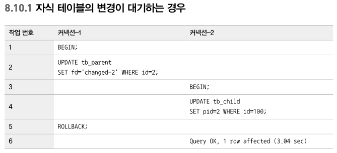
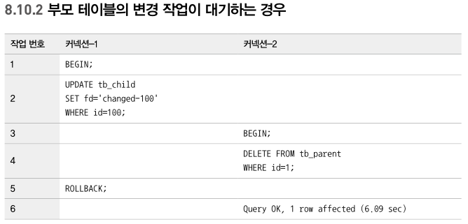

# 외래키
MySQL에서 외래키는 InnoDB에서만 생성 가능하며, 외래키 제약이 설정되면 자동으로 연관되는 테이블의 컬럼에 인덱스까지 생성됨.
외래키가 제거되지 않은 상태에서 자동으로 생성된 인덱스를 삭제할 수 없다.

- 테이블의 변경(쓰기 잠금)이 발생하는 경우에만 잠금 경합(잠금 대기)이 발생.
- 외래키와 연관되지 않은 컬럼의 변경은 최대한 잠금 경합(잠금 대기)를 발생시키지 않는다.

```sql
CREATE TABLE tb_parent(
    id INT NOT NULL,
    fd VARCHAR(100),
    PRIMARY KEY (id)
) ENGINE=InnoDB;

CREATE TABLE tb_child(
    id  INT NOT NULL,
    pid INT          DEFAULT NULL,
    fd  VARCHAR(100) DEFAULT NULL,
    PRIMARY KEY (id),
    KEY ix_parentid (pid),
    CONSTRAINT child_ibfk_1 FOREIGN KEY (pid) REFERENCES tb_parent (id) ON DELETE CASCADE
) ENGINE=InnoDB;

INSERT INTO tb_parent VALUES (1, 'parent-1'), (2, 'parent-2');
INSERT INTO tb_child VALUES (100, 1, 'child-100');
```

## 1. 자식 테이블의 변경이 대기하는 경우


```SQL
-- 커넥션 1
BEGIN;
    UPDATE tb_parent SET fd='changed-2' WHERE id=2;

-- 커넥션 2
BEGIN;
    UPDATE tb_child SET pid='changed-2' WHERE id=100;
```
커넥션1에서 먼저 트랜잭션을 시작, 부모(tb_parent) 테이블에서 id가 2인 레코드를 UPDATE 실행.
커넥션1이 id가 2인 레코드에 대해 잠금을 획득. 그리고 2번 커넥션에서 자식 테이블(tb_child)의 외래키 컬럼(부모의 키를 참조하는 컬럼)인 pid를 2로 변경하는 쿼리를 실행한다.

위 4번 쿼리는 부모 테이블의 변경 작업이 완료될 때까지 대기한다. 
다시 1번 커넥션에서 ROLLBACK이나 COMMIT으로 트랜잭션을 종료하면 2번 커넥션의 대기 중인 작업이 즉시 처리되는 것을 확인 가능.

자식 테이블의 외래 키 컬럼의 변경(INSERT, UPDATE)은 부모 테이블의 확인이 필요.
이 상태에서 부모 테이블의 해당 레코드가 쓰기 잠금이 걸려 있으면 해당 쓰기 잠금이 해제될 때까지 기다리게 되는 것.
InnoDB의 외래키 관리의 첫 번째 특징.

## 2. 부모 테이블의 변경 작업이 대기하는 경우


```SQL
-- 커넥션 1
BEGIN;
    UPDATE tb_child SET fd='changed-100' WHERE id=100;

-- 커넥션 2
BEGIN;
    DELETE FROM tb_parent WHERE  id=1;

-- 커넥션 1 롤백
ROLLBACK;
```

변경하는 테이블의 순서만 변경하여 자식 테이블의 레코드를 변경하고 쓰기 잠금을 획득. 
이 상태에서 parent 테이블에서 id가 1인 레코드를 삭제할 경우, child 테이블의 레코드에 대한 쓰기 잠금이 해제될 때까지 기다려야 한다.
이는 자식 테이블이 생성될 때 정의된 외래키의 특성(ON DELETE CASCADE)때문에 부모 레코드가 삭제되면 자식 레코드도 동시에 삭제되는 식으로 작동하기 때문.
