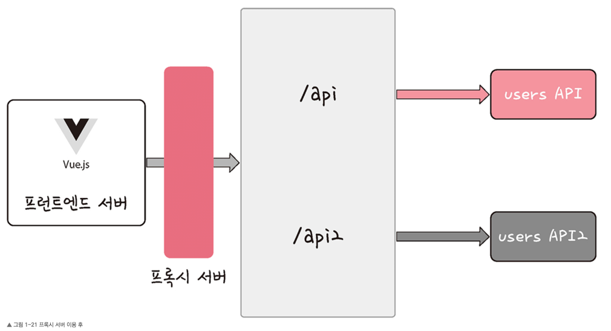

1. 싱글톤 패턴
   오직 하나의 인스턴스만 가지는 패턴.

- 장점
  인스턴스 생성 비용 절약 가능
- 단점
  TDD, 단위테스트 시 걸림돌이 되기도 함. 테스트가 서로 독립적이어야 하며, 어떤 순서로든 실행이 가능해야 하지만,
  싱글톤 패턴은 미리 생성된 하나의 인스턴스 기반으로 구현하는 패턴이므로 독립적인 인스턴스를 만들기 힘듦.
- 의존성 주입
  싱글톤 패턴은 사용하기 쉽고 실용적이지만 모듈 간의 결합을 강하게 만들 수 있다는 단점이 존재.
  이때 의존성 주입(DI)를 통해 모듈 간의 결합을 조금 더 느슨하게 만들어 해결 가능.
  메인 모듈(상위 모듈)은 하위 모듈에 대한 의존성이 떨어지게 되고, 이를 디커플링 된다고도 표현.

> 장점 - 모듈 교체가 쉬우며, 테스팅하기 쉽고, 구현 시 추상화 레이어를 넣고 이를 기반으로 구현체를 넣어 주기 떄문에 의존성 방향이 일관됨. 애플리케이션 추론이 쉬워지며, 모듈 간의 관계가 더 명확해짐.
> 단점 - 모듈이 더욱더 분리되므로 클래스 수가 늘어나 복잡성 증가, 런타임 패널티가 생기기도...

- 의존성 주입 원칙
  상위 모듈은 하위 모듈에서 어떠한 것도 가져오지 않아야 함.
  또한, 둘 다 추상화에 의존해야 하며, 추상화는 세부 사항에 의존하지 말아야 함.

2. 팩토리 패턴
   객체를 사용하는 코드에 객체 생성 부분을 떼어내 추상화한 패턴이자, 상속 관계에 있는 두 클래스에서 상위 클래스가 중요한 뼈대를 결정하고, 하위 클래스에서 객체 생성에 관한 구체적인 내용을 결정하는 패턴.

상위  클래스와 하위 클래스가 분리되기 때문에 느슨한 결합을 가지며, 상위 클래스에선 인스턴스 생성 방식에 대해 전혀 알 필요 없기 때문에 더 많은 유연성을 갖게 됨. 그리고 객체 생성 로직이 따로 떼어져 있기 때문에 코드를 리팩터링하더라도 한 곳만 고칠 수 있게 되니 유지 보수성이 증가.

3. 전략 패턴(strategy pattern, 정책 패턴 policy pattern)
   객체의 행위를 바꾸고 싶은 경우 '직접' 수정하지 않고 전략이라고 부르는 '캡슐화한 알고리즘'을 건택스트 안에서 바꿔주면서 상호 교체가 가능하게 만드는 패턴.
   
4. 옵저버 패턴
   주체가 어떤 객체(subject)의 상태 변화를 관찰하다가 상태 변화가 있을 때마다 메서드 등을 통해 옵저버 목록에 있는 옵저버들에게 변화를 알려주는 디자인 패턴.
   여기서 주체란 객체의 상태 변화를 보고 있는 관찰자이며, 옵저버들이란 이 객체의 상태 변화에 따라 전달되는 메서드 등을 기반으로 '추가 변화 사항'이 생기는 객체들을 의미.
   주체와 객체를 따로 두지 않고 상태가 변경되는 객체를 기반으로 구축하기도 함.
5. 프록시 패턴과 프록시 서버

- 프록시 패턴
  대상 객체에 접근하기 전 그 접근에 대한 흐름을 가로채 대상 객체 앞단의 인터페이스 역할을 하는 디자인 패턴.
  이를 통해 객체의 속성, 변환 등을 보완하며 보안, 데이터 검증, 캐싱, 로깅에 사용.
  프록시 객체로 쓰이기도 하지만, 프록시 서버로도 활용됨.

> 프록시 서버에서의 캐싱
> 캐시 안에 정보를 담아두고, 캐시 안에 있는 정보를 요구하는 요청에 대해 캐시 안에 있는 데이터를 활용하는 것

- 프록시 서버
  서버와 클라이언트 사이에서 클라이언트가 자신을 통해 다른 네트워크 서비스에 간접적으로 접속할 수 있게 해주는 컴퓨터 시스템이나 응용 프로그램.
  ex) nginx - 버퍼오버플로우 취약점을 예방하기 위해 사용하기도 하며 프록시 서버로 포트를 숨기거나, 정적 자원을 gzip으로 압축하거나, 메인 서버 앞단에서의 로깅을 할 수도 있음.

> - 버퍼 오버플로우 : 버퍼는 보통 데이터가 저장되는 메모리 공간, 메모리 공간을 벗어가는 경우를 의미.
>   사용되지 않아야 할 영역에 데이터가 덮어씌워져 주소, 값을 바꾸는 공격이 발생하기도...
> - gzip 압축 : LZ77과 Huffman 코딩의 조합인 DEFLATE 알고리즘을 기반으로 한 압축 기술. 데이터 전송량을 줄일 수 있지만, 압축을 해제했을 때 서버에서의 CPU 오버헤드로 gzip 압축 사용 유무를 결정해야 한다.

##### 프록시 서버로 쓰는 CloudFlare

CDN 서비스를 제공하고, DDOS 공격 방어, HTTPS 구축 등을 지원하는 회사.

##### CORS(Cross-Origin Resource Sharing)와 프런트엔드의 프록시 패턴

서버가 웹 브라우저에서 리소스를 로드할 때 다른 오리진을 통해 로드하지 못하게 하는 HTTP 헤더 기반 메커니즘

프론트엔드 개발 시 백엔드와 통신할 때 CORS가 종종 발생하는데, 이를 해결하기 위해 프록시 서버를 만들기도 함.

6. 이터레이터(iterator) 패턴
iterator를 사용하여 collection의 요소들에 접근하는 디자인 패턴.
자료형의 구조와는 상관없이 이터레이터라는 하나의 인터페이스로 순회가 가능.
- 이터레이터 프로토콜 : 이터러블한 객체들을 순회할 때 쓰이는 규칙
- 이터러블한 객체 : 반복 가능한 객체로 배열을 일반화한 객체

7. 노출모듈(revealing module) 패턴
즉시 실행 함수를 통해 private, public 같은 접근 제어자를 만드는 패턴. 자바스크립트는 private이나 public 같은 접근 제어자가 존재하지 않고, 전역 범위에서 스크립트가 실행. 그렇기 때문에 노출모듈 패턴을 통해 private, public 접근 제어자를 구현.

8. MVC 패턴
model, view, controller

9. MVP 패턴
MVC 패턴으로부터 파생되었으며, MVC에서 C에 해당하는 컨트롤러가 프레젠터(Presenter)로 교체된 패턴.

뷰와 프레젠터는 일대일 관계이기 때문에 MVC 패턴보다 더 강한 결합을 지닌 디자인 패턴이라고 볼 수 있음.

10. MVVM 패턴
MVC의 C에 해당하는 컨트롤러가 뷰모델(view model)로 바뀐 패턴.

MVC패턴과 다르게 커맨드와 데이터 바인딩을 가지는 것이 특징.
뷰와 뷰모델 사이의 양방향 데이터 바인딩을 지원하며, UI를 별도의 코드 수정 없이 재사용할 수 있고, 단위 테스팅하기 쉽다는 장점이 있음.
ex) vue.js
대표적 프레임워크. 반응형(reactivity)이 특징인 프레임워크. watch와 computed 등으로 쉽게 반응형적인 값들을 구축 가능.
함수를 사용하지 않고 값 대입만으로도 변수가 변경되며, 양방향 바인딩, html을 토대로 컴포넌트를 구축 가능한게 특징.
> - 커맨드 : 여러 가지 요소에 대한 처리를 하나의 액션으로 처리 가능한 기법
> - 데이터 바인딩 : 화면에 보이는 데이터와 웹 브라우저의 메모리 데이터를 일치시키는 기법. 뷰모델을 변경하면 뷰가 변경된다.