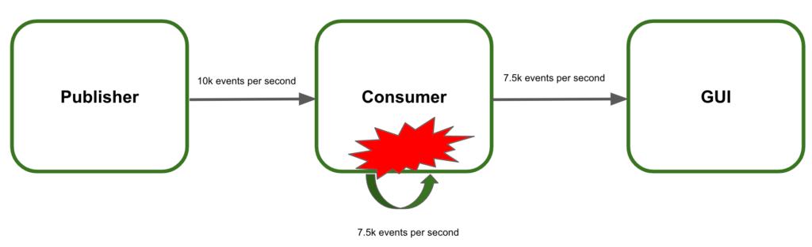
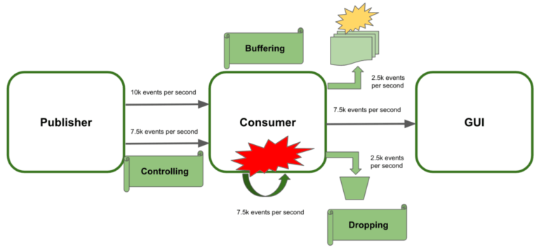

# Webflux, Reactor란?

## 사용하는 이유

## 1. 용어 정리
Publisher : 발행자, 게시자, 생산자, 방출자(Emitter)
Subscriber : 구독자, 소비자
Emit : Publisher가 데이터를 내보내는 것(방출하다. 내보내다. 통지하다.)
Sequence : Publisher가 emit하는 데이터의 연속적인 흐름. 스트림과 같은 의미라고 보면 됨
Subscribe : Subscriber가 Sequence를 구독하는 것
Dispose : Suscriber가 Sequence 구독을 해지 하는 것
Downstream : 현재 Operator 체인의 위치에서 봤을때 데이터가 전달 되는 하위 Operator 및 method 체인
Upstream : 현재 Operator 체인의 위치에서 봤을때 상위 Operator 및 method 체인


## 2. Operators UpStream, DownStream 방향 정리
Reactive Streams의 핵심 개념은 Publisher -> Data -> Subscriber의 흐름으로 데이터가 전달된다는 것이다.
아래에서 <- 방향으로의 흐름을 업스트림(Upstream)이라 하고 -> 방향으로의 흐름을 다운스트림(Downstream)이라 한다.
그리고 데이터는 업스트림에서 다운스트림 방향으로 (->) 흘러간다.
Publisher -> Data -> Subscriber
<- subscribe(Subscriber)
-> onSubscribe(Subscription)
-> onNext
-> onNext
-> ...
-> onComplete                  
Reactive Streams에서는 이 과정에서 Publisher -> [Data1] -> Operator -> [Data2] -> Operator2 -> [Data3] -> Subscriber 이런식으로 데이터를 가공하는 Operator를 적용할 수 있다.
아래와 같은 Publisher와 Subscriber가 있다고 해보자. 1부터 10까지 정수 데이터가 발생하고, Subscriber는 화면에 출력하고 프로그램은 종료된다.

## 3. Back Pressure란
Reactive Streams에서 배압은 스트림 요소의 전송을 조절하는 방법도 정의. 
즉, 수신자가 소비할 수 있는 요소 수를 제어.

시스템에는 게시자, 소비자 및 그래픽 사용자 인터페이스(GUI)의 세 가지 서비스가 포함되어 있음.
게시자는 초당 10000개의 이벤트를 소비자에게 보냄.
소비자는 이를 처리하고 결과를 GUI로 보냄.
GUI는 사용자에게 결과를 표시.
소비자는 초당 7500개의 이벤트만 처리할 수 있음.



이 속도에서는 소비자가 이벤트(배압) 를 관리할 수 없다. 
결과적으로 시스템이 무너지고 사용자는 결과를 볼 수 없을것.
 
### 배압을 사용하여 시스템 장애 방지
여기서 권장 사항은 시스템 오류를 방지하기 위해 일종의 배압 전략을 적용하는 것입니다. 목표는 수신된 추가 이벤트를 효율적으로 관리하는 것입니다.

전송된 데이터 스트림을 제어 하는 ​​것이 첫 번째 옵션 입니다. 기본적으로 게시자는 이벤트 속도를 늦춰야 합니다. 따라서 소비자는 과부하되지 않습니다. 안타깝게도 이것이 항상 가능한 것은 아니며 사용 가능한 다른 옵션을 찾아야 합니다.
여분의 데이터를 버퍼링하는 것이 두 번째 선택 입니다. 이 접근 방식을 사용하면 소비자는 나머지 이벤트를 처리할 수 있을 때까지 임시로 저장합니다. 여기서 주요 단점은 메모리 충돌을 일으키는 버퍼 바인딩을 해제하는 것입니다.
추적하지 못하는 추가 이벤트를 삭제합니다 . 이 솔루션도 이상적이지 않습니다. 이 기술을 사용하면 시스템이 붕괴되지 않습니다.



2.3. 배압 제어
게시자가 내보낸 이벤트를 제어하는데 중점을 둘 것입니다. 기본적으로 따라야 할 세 가지 전략이 있습니다.

가입자가 요청할 때만 새 이벤트를 보냅니다. 이미터 요청 시 요소를 수집하는 풀 전략입니다.
클라이언트 측에서 수신할 이벤트 수를 제한합니다. 제한된 푸시 전략으로 작동하여 게시자는 한 번에 클라이언트에 최대 항목 수를 보낼 수 있습니다.
소비자가 더 이상 이벤트를 처리할 수 없을 때 데이터 스트리밍을 취소합니다. 이 경우 수신자는 언제든지 전송을 중단하고 나중에 다시 스트림을 구독할 수 있습니다.


4.3. 한계
두 번째 옵션은   Project Reactor 의 limitRange() 연산자를 사용하는 것입니다. 
한 번에 프리페치할 항목 수를 설정할 수 있습니다 . 한 가지 흥미로운 기능은 구독자가 처리할 이벤트를 더 요청하는 경우에도 제한이 적용된다는 것 입니다. 이미터는 이벤트를 각 요청에 대한 한도 이상 소비하지 않도록 청크로 분할합니다.

```Java
@Test
public void whenLimitRateSet_thenSplitIntoChunks() throws InterruptedException {
Flux<Integer> limit = Flux.range(1, 25);

    limit.limitRate(10);
    limit.subscribe(
      value -> System.out.println(value),
      err -> err.printStackTrace(),
      () -> System.out.println("Finished!!"),
      subscription -> subscription.request(15)
    );

    StepVerifier.create(limit)
      .expectSubscription()
      .thenRequest(15)
      .expectNext(1, 2, 3, 4, 5, 6, 7, 8, 9, 10)
      .expectNext(11, 12, 13, 14, 15)
      .thenRequest(10)
      .expectNext(16, 17, 18, 19, 20, 21, 22, 23, 24, 25)
      .verifyComplete();
}
```

4.4. 취소
마지막으로 소비자는 수신할 이벤트를 언제든지 취소할 수 있습니다 . 이 예에서는 다른 접근 방식을 사용합니다. Project Reactor를 사용하면 자체 Subscriber 를 구현  하거나 BaseSubscriber 를 확장할 수 있습니다. 따라서 Listener가 언급된 클래스를 재정의하여 언제라도 새 이벤트 수신을 중단할 수 있는 방법을 살펴보겠습니다.
```Java
@Test
public void whenCancel_thenSubscriptionFinished() {
Flux<Integer> cancel = Flux.range(1, 10).log();

    cancel.subscribe(new BaseSubscriber<Integer>() {
        @Override
        protected void hookOnNext(Integer value) {
            request(3);
            System.out.println(value);
            cancel();
        }
    });

    StepVerifier.create(cancel)
      .expectNext(1, 2, 3)
      .thenCancel()
      .verify();
}
```
