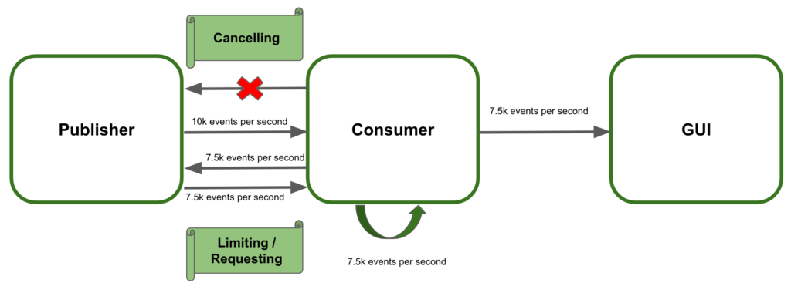

# Webflux, Reactor란?

## 사용하는 이유


### Thread 개념 이해
Reactor에서 사용되는 Scheduler
Reactor Sequence에서 사용되는 스레드를 관리해 주는 관리자 역할을 한다.

컴퓨터 시스템에서 스레드는 물리적인 스레드(Physical Thread)와 논리적인 스레드(Logical Thread)로 구분된다.

### CPU의 코어(Core)
코어는 CPUD의 명령어를 처리하는 반도체 유닛이다. 일반적으로 코어의 개수가 많으면 더 많은 수의 명령어를 더 빠르게 병렬로 처리할 수 있다.


### 코어와 물리적인 스레드 관계

https://badcandy.github.io/2019/01/14/concurrency-01/
▶ 물리적인 스레드 (Physical Thread)

하나의 코어는 두개의 스레드를 포함하고 있는데 이 두개의 스레드는 물리적인 코어를 논리적으로 나눈 것을 의미한다. 이렇게 물리적인 코어를 논리적으로 나눈 코어를 물리적인 스레드라고 한다.


▶ 논리적인 스레드 (Logical Thread)

소프트웨어적으로 생성되는 스레드를 의미하며, Java 프로그래밍에서 사용되는 스레드를 말한다. 논리적인 스레드는 프로세스 내에서 실행되는 세부 작업의 단위가 되고, 이론적으로는 메모리가 허용하는 범위 내에서 얼마든지 만들어낼 수 있다.


### 물리적인 스레드 vs 논리적인 스레드

https://badcandy.github.io/2019/01/14/concurrency-01/
위 그림에서는 무수히 많은 논리적인 스레드가 4개의 물리적인 스레드를 아주 빠른 속도로 번갈아가며 사용하면서 마치 동시에 실행되는 것처럼 보이는 동시성을 갖는다. 물리적인 스레드의 총 개수보다 더 많은 논리적인 스레드가 동시에 실행되는 것이 아니라, 어느 짧은 순간에 최대한 많이 실행된다 하더라도 물리적인 스레드의 개수 내에서 실행된다는 의미다.


▶ 물리적인 스레드는 병렬성(Parallelism)과 관련이 있다.

병렬성은 물리적인 스레드가 실제로 동시에 실행되기 때문에 여러 작업을 동시에 처리함


▶ 논리적인 스레드는 동시성(Concurrency)와 관련이 있다.

동시성은 동시에 실행되는 것처럼 보이는 것


### Cold와 Hot의 의미

Hot Swap : 컴퓨터 시스템의 전원이 켜져 있는 상태에서 디스크 등의 장치를 교체할 경우 시스템을 재시작하지 않고서도 바로 장치를 인식한다.

Hot Deploy : 서버를 재시작하지 않고서 응용 프로그램의 변경 사항을 적용한다.

Hot은 무언가 처음부터 다시 시작하지 않고, 같은 작업이 반복하지 않는 느낌이다. 이와 반대인 Cold는 처음부터 새로 시작해야하고, 새로 시작하기 때문에 같은 작업이 반복된다.
리액티브 프로그래밍에서의 Cold, Hot의 의미를 위의 내용을 바탕으로 쉽게 이해해보자. 다시 쉽게 말하자면 'Cold'는 무언가를 새로 시작하고, 'Hot'은 무언가를 새로 시작하지 않는다.

Sequence : Publisher가 emit하는 데이터의 연속적인 흐름을 정의해놓은 것이다. 코드로 표현하면 Operator 체인 형태로 정의된다.
Cold Sequence : Subscriber가 구독할 때마다 데이터의 흐흠이 처음부터 시작되는 Sequence를 말한다.


위에 있는 Subscriber A가 구독을 하면 Publisher는 4개(1, 3, 5, 7) 데이터를 emit한다.

그리고 아래에 있는 Subscriber B가 구독을 해도 Publisher는 4개(1, 3, 5, 7) 데이터를 emit 한다.


결론적으로 Subscriber A와 Subscriber B의 구독 시점이 다르지만 Subscriber A, B는 모두 동일한 데이터를 받게된다.

즉, Cold Sequence란, 구독 시점이 달라도 구독을 할 때마다 Publisher가 데이터를 emit하는 과정을 처음부터 다시 시작하는 데이터의 흐름을 말한다.

```Java 
import lombok.extern.slf4j.Slf4j;
import reactor.core.publisher.Flux;

import java.util.Arrays;

@Slf4j
public class Example7_1 {
public static void main(String[] args) throws InterruptedException {

        Flux<String> coldFlux =
                Flux
                    .fromIterable(Arrays.asList("KOREA", "JAPAN", "CHINESE"))
                    .map(String::toLowerCase);

        coldFlux.subscribe(country -> log.info("# Subscriber1: {}", country));
        System.out.println("----------------------------------------------------------------------");

        Thread.sleep(2000L);

        coldFlux.subscribe(country -> log.info("# Subscriber2: {}", country));
    }
}
// 1) fromIterable() Operator를 사용하여 List로 전달받은 데이터 소스를 emit한다.
// .fromIterable(Arrays.asList("KOREA", "JAPAN", "CHINESE"))
```
### 실행결과
```log
23:07:05.739 [main] INFO - # Subscriber1: korea
23:07:05.740 [main] INFO - # Subscriber1: japan
23:07:05.740 [main] INFO - # Subscriber1: chinese
----------------------------------------------------------------------
23:07:07.746 [main] INFO - # Subscriber2: korea
23:07:07.749 [main] INFO - # Subscriber2: japan
23:07:07.750 [main] INFO - # Subscriber2: chinese
```


예상한대로, 구독이 발생할때마다 emit된 데이터(korea, japan, chinese)를 처음부터 다시 전달한다.

Hot Sequence : Cold Sequence는 위의 설명으로 충분히 이해할 수 있을것이다. Hot Sequence는 Cold Sequence의 반대로 개념으로 이해하면 된다. Hot Sequence의 경우 구독이 발생한 시점 이전에 Publisher로부터 emit된 데이터는 Subscriber가 전달받지 못하고, 구독이 발생한 시점 이후에 emit된 데이터만 받을 수 있다.


https://devfunny.tistory.com/913

## 1. 용어 정리
Publisher : 발행자, 게시자, 생산자, 방출자(Emitter)
Subscriber : 구독자, 소비자
Emit : Publisher가 데이터를 내보내는 것(방출하다. 내보내다. 통지하다.)
Sequence : Publisher가 emit하는 데이터의 연속적인 흐름. 스트림과 같은 의미라고 보면 됨
Subscribe : Subscriber가 Sequence를 구독하는 것
Dispose : Suscriber가 Sequence 구독을 해지 하는 것
Downstream : 현재 Operator 체인의 위치에서 봤을때 데이터가 전달 되는 하위 Operator 및 method 체인
Upstream : 현재 Operator 체인의 위치에서 봤을때 상위 Operator 및 method 체인


## 2. Operators UpStream, DownStream 방향 정리
Reactive Streams의 핵심 개념은 Publisher -> Data -> Subscriber의 흐름으로 데이터가 전달된다는 것이다.
아래에서 <- 방향으로의 흐름을 업스트림(Upstream)이라 하고 -> 방향으로의 흐름을 다운스트림(Downstream)이라 한다.
그리고 데이터는 업스트림에서 다운스트림 방향으로 (->) 흘러간다.

```log
Publisher -> Data -> Subscriber
<- subscribe(Subscriber)
-> onSubscribe(Subscription)
-> onNext
-> onNext
-> ...
-> onComplete
```
                  
Reactive Streams에서는 이 과정에서 Publisher -> [Data1] -> Operator -> [Data2] -> Operator2 -> [Data3] -> Subscriber 이런식으로 데이터를 가공하는 Operator를 적용할 수 있다.
아래와 같은 Publisher와 Subscriber가 있다고 해보자. 1부터 10까지 정수 데이터가 발생하고, Subscriber는 화면에 출력하고 프로그램은 종료된다.

## 3. Back Pressure란
Reactive Streams에서 배압은 스트림 요소의 전송을 조절하는 방법도 정의. 
즉, 수신자가 소비할 수 있는 요소 수를 제어.

시스템에는 게시자, 소비자 및 그래픽 사용자 인터페이스(GUI)의 세 가지 서비스가 포함되어 있음.
게시자는 초당 10000개의 이벤트를 소비자에게 보냄.
소비자는 이를 처리하고 결과를 GUI로 보냄.
GUI는 사용자에게 결과를 표시.
소비자는 초당 7500개의 이벤트만 처리할 수 있음.


이 속도에서는 소비자가 이벤트(배압) 를 관리할 수 없다. 
결과적으로 시스템이 무너지고 사용자는 결과를 볼 수 없을것.
 
### 배압을 사용하여 시스템 장애 방지
여기서 권장 사항은 시스템 오류를 방지하기 위해 일종의 배압 전략을 적용하는 것입니다. 목표는 수신된 추가 이벤트를 효율적으로 관리하는 것입니다.

전송된 데이터 스트림을 제어 하는 것이 첫 번째 옵션 입니다. 기본적으로 게시자는 이벤트 속도를 늦춰야 합니다. 따라서 소비자는 과부하되지 않습니다. 안타깝게도 이것이 항상 가능한 것은 아니며 사용 가능한 다른 옵션을 찾아야 합니다.
여분의 데이터를 버퍼링하는 것이 두 번째 선택 입니다. 이 접근 방식을 사용하면 소비자는 나머지 이벤트를 처리할 수 있을 때까지 임시로 저장합니다. 여기서 주요 단점은 메모리 충돌을 일으키는 버퍼 바인딩을 해제하는 것입니다.
추적하지 못하는 추가 이벤트를 삭제합니다. 이 솔루션도 이상적이지 않습니다. 이 기술을 사용하면 시스템이 붕괴되지 않습니다.


2.3. 배압 제어
게시자가 내보낸 이벤트를 제어하는데 중점을 둘 것입니다. 기본적으로 따라야 할 세 가지 전략이 있습니다.

가입자가 요청할 때만 새 이벤트를 보냅니다. 이미터 요청 시 요소를 수집하는 풀 전략입니다.
클라이언트 측에서 수신할 이벤트 수를 제한합니다. 제한된 푸시 전략으로 작동하여 게시자는 한 번에 클라이언트에 최대 항목 수를 보낼 수 있습니다.
소비자가 더 이상 이벤트를 처리할 수 없을 때 데이터 스트리밍을 취소합니다. 이 경우 수신자는 언제든지 전송을 중단하고 나중에 다시 스트림을 구독할 수 있습니다.



4.3. 한계
두 번째 옵션은   Project Reactor 의 limitRange() 연산자를 사용하는 것입니다. 
한 번에 프리페치할 항목 수를 설정할 수 있습니다. 한 가지 흥미로운 기능은 구독자가 처리할 이벤트를 더 요청하는 경우에도 제한이 적용된다는 것 입니다. 이미터는 이벤트를 각 요청에 대한 한도 이상 소비하지 않도록 청크로 분할합니다.

```Java
@Test
public void whenLimitRateSet_thenSplitIntoChunks() throws InterruptedException {
Flux<Integer> limit = Flux.range(1, 25);

    limit.limitRate(10);
    limit.subscribe(
      value -> System.out.println(value),
      err -> err.printStackTrace(),
      () -> System.out.println("Finished!!"),
      subscription -> subscription.request(15)
    );

    StepVerifier.create(limit)
      .expectSubscription()
      .thenRequest(15)
      .expectNext(1, 2, 3, 4, 5, 6, 7, 8, 9, 10)
      .expectNext(11, 12, 13, 14, 15)
      .thenRequest(10)
      .expectNext(16, 17, 18, 19, 20, 21, 22, 23, 24, 25)
      .verifyComplete();
}
```

4.4. 취소
마지막으로 소비자는 수신할 이벤트를 언제든지 취소할 수 있습니다. 이 예에서는 다른 접근 방식을 사용합니다. Project Reactor를 사용하면 자체 Subscriber 를 구현  하거나 BaseSubscriber 를 확장할 수 있습니다. 따라서 Listener가 언급된 클래스를 재정의하여 언제라도 새 이벤트 수신을 중단할 수 있는 방법을 살펴보겠습니다.
```Java
@Test
public void whenCancel_thenSubscriptionFinished() {
Flux<Integer> cancel = Flux.range(1, 10).log();

    cancel.subscribe(new BaseSubscriber<Integer>() {
        @Override
        protected void hookOnNext(Integer value) {
            request(3);
            System.out.println(value);
            cancel();
        }
    });

    StepVerifier.create(cancel)
      .expectNext(1, 2, 3)
      .thenCancel()
      .verify();
}
```

### Backpressure 전략

Reactor에서는 Backpressure를 위한 다양한 전략을 제공한다.

| 종류	        |   설명  |
|------------|-----------|
|  IGNORE 전략 |	Backpressure를 적용하지 않는다. |
| ERROR 전략	  |   Downstream으로 전달할 데이터가 버퍼에 가득 찰 경우, Exception을 발생시킨다.    |
| DROP 전략	   |   Downstream으로 전달할 데이터가 버퍼에 가득 찰 경우, 버퍼 밖에서 대기하는 먼저 emit된 데이터부터 Drop시킨다.  |
| LATEST 전략  |	Downstream으로 전달할 데이터가 버퍼에 가득 찰 경우, 버퍼 밖에서 대기하는 가장 최근에(나중에) emit된 데이터부터 버퍼에 채운다. |
| BUFFER 전략  |	Downstream으로 전달할 데이터가 버퍼에 가득 찰 경우, 버퍼 안에 있는 데이터부터 Drop시킨다.  |


#### IGNORE 전략
Downstream에서의 backpressure 요청이 무시되기 때문에 IllegalStateException이 발생할 수 있다.


#### ERROR 전략
Downstream의 데이터 처리 속도가 느려서 Upstream의 emit 속도를 따라가지 못할 경우 IllegalStateException을 발생시킨다.
Publisher는 Error Signal을 Subscriber에게 전송하고 삭제한 데이터는 폐기한다.

```Java
@Slf4j
public class Example8_2 {
    public static void main(String[] args) throws InterruptedException {
        Flux
            .interval(Duration.ofMillis(1L))
            .onBackpressureError()
            .doOnNext(data -> log.info("# doOnNext: {}", data))
            .publishOn(Schedulers.parallel())
            .subscribe(data -> {
        try {
        Thread.sleep(5L);
        } catch (InterruptedException e) {}
        log.info("# onNext: {}", data);
        },
        error -> log.error("# onError", error));

        Thread.sleep(2000L);
    }
}
```

1) interval()

0부터 1씩 증가한 숫자를 0.001초에 한번씩 아주 빠른 속도로 emit한다.

.interval(Duration.ofMillis(1L))


2) Subscriber 데이터 처리 속도 설정

Subscriber가 전달받은 데이터를 처리하는데 0.005초 시간이 걸리도록 설정한다.

```Java
.subscribe(data -> {
try {
Thread.sleep(5L);
} catch (InterruptedException e) {}
log.info("# onNext: {}", data);
},
error -> log.error("# onError", error));
```


3) onBackpressureError()

ERROR 전략을 사용한다.

>.onBackpressureError()


4) doOnNext()

Publisher가 emit한 데이터를 확인하거나 추가적인 동작을 정의하는 용도로 사용되는데, 주로 디버깅 용도로 사용할 수 있다.

>.doOnNext(data -> log.info("# doOnNext: {}", data))
.publishOn(Schedulers.parallel())


5) publishOn()

Reactor Sequence 중 일부를 별도 스레드에서 실행할 수 있도록 해주는 Operator이다.

>.publishOn(Schedulers.parallel())


실행결과
```log
[parallel-2] INFO - # doOnNext: 0
[parallel-2] INFO - # doOnNext: 1
[parallel-2] INFO - # doOnNext: 2
[parallel-2] INFO - # doOnNext: 3
...
[parallel-1] INFO - # onNext: 254
[parallel-1] INFO - # onNext: 255
[parallel-1] ERROR- # onError
reactor.core.Exceptions$OverflowException: The receiver is overrun by more signals than expected (bounded queue...)
at reactor.core.Exceptions.failWithOverflow(Exceptions.java:220)
at reactor.core.publisher.Flux.lambda$onBackpressureError$27(Flux.java:6739)
at reactor.core.publisher.FluxOnBackpressureDrop$DropSubscriber.onNext(FluxOnBackpressureDrop.java:135)
at reactor.core.publisher.FluxInterval$IntervalRunnable.run(FluxInterval.java:125)
at reactor.core.scheduler.PeriodicWorkerTask.call(PeriodicWorkerTask.java:59)
at reactor.core.scheduler.PeriodicWorkerTask.run(PeriodicWorkerTask.java:73)
at java.base/java.util.concurrent.Executors$RunnableAdapter.call(Executors.java:515)
at java.base/java.util.concurrent.FutureTask.runAndReset(FutureTask.java:305)
at java.base/java.util.concurrent.ScheduledThreadPoolExecutor$ScheduledFutureTask.run(ScheduledThreadPoolExecutor.java:305)
at java.base/java.util.concurrent.ThreadPoolExecutor.runWorker(ThreadPoolExecutor.java:1128)
at java.base/java.util.concurrent.ThreadPoolExecutor$Worker.run(ThreadPoolExecutor.java:628)
at java.base/java.lang.Thread.run(Thread.java:829)
```

OverflowException이 발생하면서 Sequence가 종료된다. 참고로 OverflowException은 IllegalStateException을 상속한 하위 클래스이다.


#### DROP 전략
Publisher가 Downstream으로 전달할 데이터가 버퍼에 가득 찰 경우, 버퍼 밖에서 대기중인 데이터 중에서 먼저 emit된 데이터부터 Drop시키는 전략이다. Drop된 데이터는 폐기된다.

```Java
@Slf4j
public class Example8_3 {
    public static void main(String[] args) throws InterruptedException {
        Flux
            .interval(Duration.ofMillis(1L))
            .onBackpressureDrop(dropped -> log.info("# dropped: {}", dropped))
            .publishOn(Schedulers.parallel())
            .subscribe(data -> {
        try {
            Thread.sleep(5L);
        } catch (InterruptedException e) {}
            log.info("# onNext: {}", data);
        },
        error -> log.error("# onError", error));

        Thread.sleep(2000L);
    }
}
```

1) DROP 전략을 사용한다.

.onBackpressureDrop(dropped -> log.info("# dropped: {}", dropped))
onBackpressureDrop()은 DROP된 데이터를 파라미터로 전달받을 수 있기 때문에 Drop된 데이터가 폐기되기 전에 추가 작업을 진행할 수 있다.


#### 실행결과
```log
[parallel-1] INFO - # onNext: 0
[parallel-1] INFO - # onNext: 1
[parallel-1] INFO - # onNext: 2
...
[parallel-1] INFO - # onNext: 38
[parallel-1] INFO - # onNext: 39
[parallel-1] INFO - # dropped: 256
[parallel-1] INFO - # dropped: 257
[parallel-1] INFO - # dropped: 258
[parallel-1] INFO - # onNext: 40
```

첫번째 Drop 구간에서 Drop이 시작되는 데이터는 숫자 '256'이다.

'256'부터 '258'까지의 구간동안 버퍼가 가득 차 있는 상태임을 알 수 있고, 258까지 Drop되기 때문에 Subscriber쪽에서는 숫자 40부터 전달받아 처리한다.


이처럼 Backpressure DROP 전략을 사용하면 버퍼가 가득 찬 상태에서는 버퍼가 비워질 때까지 데이터를 Drop한다.


#### LATEST 전략
Publisher가 Downstream으로 전달할 데이터가 버퍼에 가득 찰 경우, 버퍼 밖에서 대기 중인 데이터 중에서 가장 최근에(나중에) emit된 데이터부터 버퍼에 채우는 전략이다.


DROP 전략과의 차이
DROP 저냙은 버퍼가 가득 찰 경우 버퍼 밖에서 대기중인 데이터를 하나씩 차례대로 DROP 하면서 폐기하지만, LATEST 전략은 새로운 데이터가 들어오는 시점에 가장 최근의 데이터만 남겨두고 나머지 데이터를 폐기한다.


```Java
@Slf4j
public class Example8_4 {
    public static void main(String[] args) throws InterruptedException {
        Flux
            .interval(Duration.ofMillis(1L))
            .onBackpressureLatest()
            .publishOn(Schedulers.parallel())
            .subscribe(data -> {
        try {
            Thread.sleep(5L);
        } catch (InterruptedException e) {}
            log.info("# onNext: {}", data);
        },
        error -> log.error("# onError", error));

        Thread.sleep(2000L);
    }
}
```

1) LATEST 전략을 사용한다.

>.onBackpressureLatest()


#### 실행결과
```log
[parallel-1] INFO - # onNext: 0
[parallel-1] INFO - # onNext: 1
[parallel-1] INFO - # onNext: 2
...
[parallel-1] INFO - # onNext: 243
[parallel-1] INFO - # onNext: 244
[parallel-1] INFO - # onNext: 245
[parallel-1] INFO - # onNext: 246
[parallel-1] INFO - # onNext: 247
[parallel-1] INFO - # onNext: 248
[parallel-1] INFO - # onNext: 249
[parallel-1] INFO - # onNext: 250
[parallel-1] INFO - # onNext: 251
[parallel-1] INFO - # onNext: 252
[parallel-1] INFO - # onNext: 253
[parallel-1] INFO - # onNext: 254
[parallel-1] INFO - # onNext: 255
[parallel-1] INFO - # onNext: 1286
```

Subscriber가 숫자 '255' 출력후 바로 '1286'을 출력하고있다. 이는 버퍼가 가득 찼다가 버퍼가 다시 비워지는 시간동안 emit되는 데이터가 가장 최근에 emit된 데이터가 된 후, 다음 데이터가 emit되면 다시 폐기되는 과정을 반복하기 때문이다.


#### BUFFER 전략
컴퓨터 시스템에서의 버퍼

입출력을 수행하는 장치들간의 속도 차이를 조절하기 위해 입출력 장치 중간에 위치해서 데이터를 어느정도 쌓아 두었다가 전송하는것


Backpressure BUFFER 전략도 이와 비슷하다. Backpressure BUFFER 전략은 아래의 전략들을 제공한다.

버퍼의 데이터를 폐기하지 않고 버퍼링을 하는 전략
버퍼가 가득 차면 버퍼 내의 데이터를 폐기하는 전략
버퍼가 가득 차면 에러를 발생시키는 전략


버퍼가 가득 차면 버퍼 내의 데이터를 폐기하는 전략
위에서 공부한 DROP 전략과 LATEST 전략을 버퍼 바깥쪽의 데이터를 폐기했다면, BUFFER 전략은 BUFFER 안에 있는 데이터를 폐기한다.


#### DROP_LATEST 전략
Publisher가 Downstream으로 전달할 데이터가 버퍼에 가득 찰 경우, 가장 최근에(나중에) 버퍼 안에 채워진 데이터를 Drop하여 폐끼한 후, 이렇게 확보된 공간에 emit된 데이터를 채우는 전략이다.

```Java
@Slf4j
public class Example8_5 {
    public static void main(String[] args) throws InterruptedException {
        Flux
            .interval(Duration.ofMillis(300L))
            .doOnNext(data -> log.info("# emitted by original Flux: {}", data))
            .onBackpressureBuffer(2,
                dropped -> log.info("** Overflow & Dropped: {} **", dropped),
                BufferOverflowStrategy.DROP_LATEST)
            .doOnNext(data -> log.info("[ # emitted by Buffer: {} ]", data))
            .publishOn(Schedulers.parallel(), false, 1)
            .subscribe(data -> {
        try {
            Thread.sleep(1000L);
        } catch (InterruptedException e) {}
            log.info("# onNext: {}", data);
        },
        error -> log.error("# onError", error));

        Thread.sleep(2500L);
    }
}
```

1) onBackpressureBuffer()

>.onBackpressureBuffer(2,
dropped -> log.info("** Overflow & Dropped: {} **", dropped),
BufferOverflowStrategy.DROP_LATEST)

첫번째 파라미터 : 버퍼의 최대 용량을 2로 설정
두번째 파라미터 : 버퍼 오버플로가 발생했을때, DROP되는 데이터를 전달받아 후처리 수행
세번재 파라미터 : 적용할 Backpressure 전략 설정


#### 실행결과
```log
[main] DEBUG- Using Slf4j logging framework
[parallel-2] INFO - # emitted by original Flux: 0
[parallel-2] INFO - [ # emitted by Buffer: 0 ]
[parallel-2] INFO - # emitted by original Flux: 1
[parallel-2] INFO - # emitted by original Flux: 2
[parallel-2] INFO - # emitted by original Flux: 3
[parallel-2] INFO - ** Overflow & Dropped: 3 **
[parallel-1] INFO - # onNext: 0
[parallel-1] INFO - [ # emitted by Buffer: 1 ]
[parallel-2] INFO - # emitted by original Flux: 4
[parallel-2] INFO - # emitted by original Flux: 5
[parallel-2] INFO - ** Overflow & Dropped: 5 **
[parallel-2] INFO - # emitted by original Flux: 6
[parallel-2] INFO - ** Overflow & Dropped: 6 **
[parallel-1] INFO - # onNext: 1
[parallel-1] INFO - [ # emitted by Buffer: 2 ]
[parallel-2] INFO - # emitted by original Flux: 7
```

숫자 0이 emit되고, 버퍼에 잠시 채워진 다음 버퍼에서 다시 emit된다.
원본 Flux가 emit한 숫자 0을 Subscriber가 처리하기까지 1초 정도의 시간이 걸린다.
Subscriber가 숫자 0을 처리하는 1초의 시간동안 원본 Flux에서는 0.3초에 한번씩 숫자 1, 2를 emit한다. 버퍼의 최대 용량이 2이기 때문에 버퍼에는 1, 2가 채워진다.
버퍼 : [2, 1]
0.3초 뒤에 원본 Flux에서 숫자 3을 emit하는데, 버퍼 안에 3이 채워지는 순간, 버퍼가 이미 꽉 차있으므로 숫자 3은 Drop된다.
Subscriber가 숫자 1을 처리하는 1초의 시간동안 원본 Flux에서는 숫자 4를 emit하여 버퍼에 채워진다.
버퍼 : [4,2]
위와 같은 단계로 버퍼가 꽉 차있으면 버퍼 안에 제일 최근에(나중에) 채워진 숫자가 DROP된다.


#### DROP_OLDEST 전략
Publisher가 Downstream으로 전달할 데이터가 버퍼에 가득 찰 경우, 버퍼 안에 채워진 데이터 중에서 가장 오래된 데이터를 Drop하여 폐기한 후, 확보된 공간에 emit된 데이터를 채우는 전략이다.

```Java
@Slf4j
public class Example8_6 {
    public static void main(String[] args) throws InterruptedException {
        Flux
            .interval(Duration.ofMillis(300L))
            .doOnNext(data -> log.info("# emitted by original Flux: {}", data))
            .onBackpressureBuffer(2,
            dropped -> log.info("** Overflow & Dropped: {} **", dropped),
                BufferOverflowStrategy.DROP_OLDEST)
            .doOnNext(data -> log.info("[ # emitted by Buffer: {} ]", data))
            .publishOn(Schedulers.parallel(), false, 1)
            .subscribe(data -> {
        try {
            Thread.sleep(1000L);
        } catch (InterruptedException e) {}
            log.info("# onNext: {}", data);
        },
        error -> log.error("# onError", error));

        Thread.sleep(2500L);
    }
}
```


1) onBackpressureBuffer()

>.onBackpressureBuffer(2,
dropped -> log.info("** Overflow & Dropped: {} **", dropped),
BufferOverflowStrategy.DROP_OLDEST)

첫번째 파라미터 : 버퍼의 최대 용량을 2로 설정
두번째 파라미터 : 버퍼 오버플로가 발생했을때, DROP되는 데이터를 전달받아 후처리 수행
세번재 파라미터 : 적용할 Backpressure 전략 설정


#### 실행결과
```log
[parallel-2] INFO - # emitted by original Flux: 0
[parallel-2] INFO - [ # emitted by Buffer: 0 ]
[parallel-2] INFO - # emitted by original Flux: 1
[parallel-2] INFO - # emitted by original Flux: 2
[parallel-2] INFO - # emitted by original Flux: 3
[parallel-2] INFO - ** Overflow & Dropped: 1 **
[parallel-1] INFO - # onNext: 0
[parallel-1] INFO - [ # emitted by Buffer: 2 ]
[parallel-2] INFO - # emitted by original Flux: 4
[parallel-2] INFO - # emitted by original Flux: 5
[parallel-2] INFO - ** Overflow & Dropped: 3 **
[parallel-2] INFO - # emitted by original Flux: 6
[parallel-2] INFO - ** Overflow & Dropped: 4 **
[parallel-1] INFO - # onNext: 2
[parallel-1] INFO - [ # emitted by Buffer: 5 ]
[parallel-2] INFO - # emitted by original Flux: 7
```

원본 Flux에서 숫자 0이 emit되고, 버퍼에 잠시 채워진 다음 버퍼에서 다시 emit된다.
원본 Flux가 emit한 숫자 0을 Subscriber가 처리하기까지 1초 정도의 시간이 걸린다.
Subscriber가 숫자 0을 처리하는 1초의 시간동안 원본 Flux에는 0.3초에 한번씩 숫자 1, 2를 emit한다. 버퍼의 최대 용량이 2이므로 이 시점에 버퍼에는 1,2가 채워진다.
버퍼 : [2, 1]
0.3초 뒤에 원본 Flux에서 숫자 3을 emit한다. 버퍼 안에 3이 채워지는 순간, 버퍼는 이미 꽉 차있기 때문에 버퍼 오버플로가 발생하고 버퍼 안에 있는 데이터 중에서 가장 오래된 데이터인 숫자 1이 Drop된다.
버퍼 : [3, 2]
버퍼에서 숫자 2가 emit된다.
버퍼 : [3]
위와 같은 단계로 버퍼가 꽉 차있으면 버퍼 안에 제일 오래된(먼저) 채워진 숫자가 DROP된다.

 

 