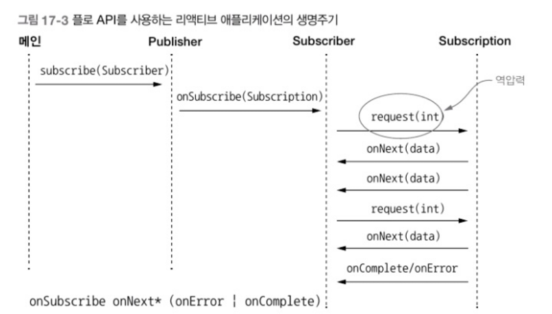

# 17. 리액티브 프로그래밍
## 1. 리액티브 매니패스토
1. 반응성(responsive) : 리액티 시스템을 빠를 뿐 아니라 더 중요한 특징으로 일정하고 예상할 수 있는 반응 시간을 제공.
결과적으로 사용자가 기대치를 가질 수 있다.
기대치를 통해 사용자의 확신이 증가하면서 사용할 수 있는 어플리케이션이라는 확인을 제공 가능.
2. 회복성(resilient) : 장애가 발생해도 시스템은 반응해야 한다. 
컴포넌트 실행 복제, 여러 컴포넌트의 시간(발송자와 수신자가 독립적인 생명주기를 가짐)과 
공간(발송자와 수신자가 다른 프로세스에서 실행됨) 분리, 각 컴포넌트가 비동기적으로 작업을 다른 컴포넌트에 위임하는 등 리액티브 매니페스토는 회복성을 달성할 수 있는 다양한 기법을 제시.
3. 탄력성(elastic) : 어플리케이션의 생명주기 동안 다양한 작업 부하를 받게 되는데, 이 다양한 작업 부하로 애플리케이션의 반응성이 위협받을 수 있다.
리액티브 시스템에선 무거운 작업 부하가 발생하면 자동으로 관련 컴포넌트에 할당된 자원 수를 늘린다.
4. 메시지 주도(Message-driven) : 회복성과 탄력성을 지원하려면 약한 결합, 고립, 위치 투명성 등을 지원할 수 있도록 시스템을 구성하는 컴포넌트의 경계를 명확하게 정의해야 한다.
비동기 메시지를 전달해 컴포넌트 끼리의 통신이 이뤄진다. 이 덕분에 회복성(장애를 메시지로 처리)과 탄력성(주고 받은 메시지의 수를 감시하고 메시지의 양에 따라 적절하게 리소스를 할당)을 얻을 수 있다.


이벤트 스트림을 블록하지 않고 비동기로 처리하는 것이 최신 멀티코어 CPU의 사용률을 극대화(내부적으로 경쟁하는 CPU의 스레드 사용률)할 수 있는 방법.
이 목표 달성을 위해 리엑티브 프레임워크와 라이브러리는 스레드(상대적으로 비싸고 희귀한 자원)를 퓨처, 엑터, 일련의 콜백을 발생시키는 이벤트 루프 등과 공유하고 처리할 이벤트를 변환하고 관리.

스레드보다 가벼울 뿐 아니라, 이들 기술을 이용함으로 동시, 비동기 애플리케이션 구현의 추상 수준을 높일 수 있으므로 동기 블록, 경쟁 조건, 데드락 같은 저 수준의 멀티스레드 문제를 직접 처리할 필요가 없어지면서 비즈니스 요구사항을 구현하는 데 집중할 수 있다.

스레드풀 2개에 스트림 3개가 돈다면, 아래와 같은 비효율적인 상황이 발생할수 있다.


리액티브 시스템 : 여러 어플리케이션이 한 개의 일관적인, 회복할 수 있는 플랫폼을 구성할 수 있게 해줄 뿐 아니라 이들 어플리케이션 중 하나가 실패해도 전체 시스템은 계속 운영될 수 있도록 도와주는 소프트웨어 아키텍처.


## 2. 리액티브 스트림과 플로 API
리액티브 프로그래밍 : 리액티브 스트림을 사용하는 프로그래밍.
잠재적으로 무한의 비동기 데이터를 순서대로, 그리고 블록하지 않는 역압력(발행-구독 프로토콜에서 이벤트 스트림의 구독자가 발행자가 이벤트를 제공하는 속도보다 느린 속도로 이벤트를 소비하면서 문제가 발생하지 않도록 보장하는 장치)을 전제해 처리하는 표준 기술.

스트림 처리의 비동기적인 특성상 역압력 기능의 내장은 필수.
비동기 작업을 실행하는 동안 시스템엔 암묵적으로 블록 API로 인해 역압력이 제공되는 것.
비동기 API를 이용하면 하드웨어 사용률을 극대화할 수 있지만, 다른 느린 다운스트림 컴포넌트에 너무 큰 부하를 줄 가능성도 생긴다.
따라서 이런 상황을 방지하기 위해 역압력이나 제어 흐름 기법이 필요.

### 2.1 Flow 클래스
java.util.concurrent.Flow
- Publisher
- Subscriber
- Subscription
- Processor

Publisher가 항목을 발행, Subscriber가 한 개씩 또는 한 번에 여러 항목을 소비.
Flow 클래스는 관련 인터페이스와 정적 메서드를 제공.
Subscriber의 요구사항에 따라 역압력 기법에 의해 이벤트 제공 속도가 제한.

```Java
@FunctionalInterface
public interface Publisher<T> {
    void subscribe(Subscriber<? super T> s);
}

public interface Subscriber<T> {
    void onSubscribe(Subscription s);
    void onNext(T t);
    void onError(Throwable t);
    void onComplete();
}
```
이들 이벤트는 다음 프로토콜에서 정의한 순서로 지정된 메서드 호출을 통해 발행해야 한다.
onSubscribe onNext* (onError | onComplete);

onNext는 여러번 호출 가능


```Java
public interface Subscription{
    void request(long n);
    void cancel();
}
```

Publisher는 반드시 Subscription의 request 메서드에 정의된 개수 이하의 요소만 Subscriber에 전달해야 한다.
But, Publisher는 지정된 개수보다 적은 수의 요소를 onNext로 전달 가능하며, 동작이 성공적으로 끝났으면 onComplete를 호출, 문제가 발생하면 onError를 호출해 Subscription을 종료 가능.



#### Flow.Processor 인터페이스
```Java
public interface Processor<T, R> extends Subscriber<T>, Publisher<R> {}
```

- TempInfo. 원격 온도계를 흉내 (0~99도)
- TempSubscriber. 레포트를 관찰하면서 각 도시에 설치된 센서에서 보고한 온도 스트림 출력

```Java
@Getter
@ToString
@AllArgumet
public class TempInfo {
    public static final Random random = new Random();
    
    private final String town;
    private final int temp;
    
    public static TempInfo fetch(String town) {
        if(random.nextInt(10) == 0)
            throw new RuntimeException("Error!");
        return new TempInfo(town, random.nextInt(100));
    }
}

//Subscriber에게 TempInfo 스트림 전송
public class TempSubscription implements Subscription {
    private final Subscriber<? super TempInfo> subscriber;
    private final String town;
    
    public TempSubscription(Subscriber<? super TempInfo> subscriber, String town) {
        this.subscriber = subscriber;
        this.town = town;
    }
    
    @Override
    public void request(long n) {
        for(long i = 0L; i < n; i++) {
            try {
                subscriber.onNext(TempInfo.fetch(town));
            } catch(Exception e) {
                subscriber.onError(e);
                break;
            }
        }
    }
    
    @Override
    public void cancel() {
        subscriber.onComplete();
    }
}

//받은 온도를 출력하는 Subscriber
class TempSubscriber implements Subscriber<TempInfo> {
    private Subscription subscription;
    
    // 구독을 저장하고 첫 번째 요청을 전달
    @Override
    public void onSubscribe(Subscription subscription) {
        this.subscription = subscription;
        subscription.request(1);
    }
    
    // 수신한 온도를 출력하고 다음 정보를 요청
    @Override
    public void onNext(TempInfo tempInfo) {
        System.out.println(tempInfo);
        subscription.request(1);
    }
    
    // 에러가 발생하면 에러 메시지 출력
    @Override
    public void onError(Throwable t) {
        System.err.println(t.getMessage());
    }
    
    @Override
    public void onComplete() {
        System.out.println("Done!");
    }
    
}

// Publisher를 만들고 TempSubscriber를 구독시킴
class Main {
    public static void main(String[] args) {
        //뉴욕에 새 Publisher를 만들고 TempSubscriber를 구독시킴
        getTemperatures("New York").subscribe(new TempSubscriber());
    }
    
    //구독한 Subscriber에게 TempSubscription을 전송하는 Publisher를 반환
    private static Publisher<TempInfo> getTemperatures(String town) {
        return subscriber -> subscriber.onSubscribe(
                new TempSubscription(subscriber, town)
        );
    }
}
```

> New York : 44</br>
> New York : 68</br>
> New York : 95</br>
> New York : 30</br>
> Error! << StackOverflowError

이러한 재귀호출은 스택오버플로를 발생시킴.

해결 방법으론 Excutor를 TempSubscription으로 추가한 다음 다른 스레드에서 TempSubscriber로 새 요소를 전달하는 방법이 있다.
```Java
public class TempSubscription implements Subscription {
    // 기존 코드 생략
    private static final ExecutorService executor = Executors.newSingleThreadExecutor();
    
    @Override
    public void request(long n) {
        executor.submit( () -> {
            for (long i = 0L; i < n; i++) {
                try{
                    subscriber.onNext(TempInfo.fetch(town));
                } catch(Exception e) {
                    subscriber.onError(e);
                    break;
                }
            }
        });
    }
}
```


## Processor로 데이터 변환하기
```Java
import java.util.concurrent.Flow.*;

public class TempProcessor implements  Processor<TempInfo, TempInfo> {
    private Subscriber<? super TempInfo> subscriber;
    
    @Override
    public void subscribe( Subscriber<? super TempInfo> subscriber) {
        this.subscriber = subscriber;
    }

    @Override
    public void onNext(TempInfo temp) {
        // 화씨를 섭씨로 변환
        subscriber.onNext(new TempInfo(
                temp.getTown(), 
                (temp.getTemp() - 32) * 5 / 9 ) 
        );
    }
    
    // 하단 3개는 업스트림 구독자에 전달
    @Override
    public void onSubscribe(Subscription subscription) {
        subscriber.onSubscribe(subscriber);
    }
    @Override
    public void onError(Throwable throwable) {
        subscriber.onError(throwable);
    }
    @Override
    public void onComplete() {
        subscriber.onComplete();
    }
}

// Publisher를 만들고 TempSubscriber를 구독시킴
class Main {
    public static void main(String[] args) {
        //뉴욕의 섭씨 온도를 전송할 Publisher를 만듦
        getTemperatures("New York").subscribe(new TempSubscriber());
    }

    //TempProcessor를 만들고 Subscriber와 반환된 Publisher 사이로 연결
    private static Publisher<TempInfo> getTemperatures(String town) {
        return subscriber -> {
            TempProcessor processor = new TempSubscription();
            processor.subscribe(subscriber);
            processor.onSubscribe(new TempProcessor(processor, town));
        };
                
        
    }
}
```

> New York : 10</br>
> New York : -12</br>
> New York : 23</br>
> Error! 

RxJava 사용... skip


# 스프링 부트 실전 활용 마스터
프로젝트 리액터 : VMware에서 만든 리액티브 스트림 구현체.
- 논블로킹, 비동기 프로그래밍 모델
- 함수형 프로그래밍 스타일
- 스레드를 신경 쓸 필요 없는 동시성

## 리액터 타입
Flux<T>를 사용해서 수요 조절을 구현.
실제 물건을 전달해주는 역할을 하는 플레이스홀더로, 쉽게말해 레스토랑에서 일하는 서빙 점원과 비슷.
주방에서 요리가 완성되면 점원이 주방에서 요리를 받아 손님에게 가져다주고, 다시 제자리로 돌아와 다음 요리를 기다린다.

서빙 점원은 다음 요리가 주방에서 언제 완성될지 알 수 없다.
요리가 완성되고, 서빙 점원이 그 요리를 받아 전달할 수 있는 상태라면, 서빙 점원은 다음 요리를 손님에게 가져다준다.

```Java
class KitchenService {
    Flux<Dish> getDishes() {
        //요리를 담당하는 ChefService를 모델링해서 요리를 위임할 수 있지만 하드코딩으로
        return Flux.just(
                new Dish("Sesame chicken"),
                new Dish("Lo mein noodles, plain"),
                new Dish("Sweet $ sour beef")
        );
    }
}
```
서빙 점원은 손님에게 가져다줄 요리 객체를 달라고 KitchenService에 요청할 수 있다.
코드는 세 가지 요리가 모두 완성된 후에 받을 수 있는 상태.
Flux<Dish> 안에 포함된 요리는 아직 완성되지 않았지만, 머지않아 완성될 것. 언제 완성될지는 알 수 없다.

하지만 요리가 완성되면 서빙 점원은 행동act에 나설 수 있다. 즉 요리 완성에 대한 반응 행동, react라고 할 수 있다.
리액터는 논블로킹 방식으로 동작하기 때문에, 주방에서 요리가 완성될 때까지 서빙 점원(서버 스레드)이 다른 일을 못 한 채 계속 기다리게 하지 않는다.

결과가 아직 정해지지 않았고, 미래 어느 시점이 되어야 알 수 있다는 점에서 Flux는 Future와 비슷하다.
결과를 미래에 알 수 있다는 관점에서는 비슷하지만, Future는 이미 시작되었음을 나타내는 반면, Flux는 시작할 수 있음을 나타냄.

Future는 제공해주지 않지만 Flux는 제공해주는 것
- 하나 이상의 Dish(요리) 포함 가능
- 각 Dish(요리)가 제공될 때 어떤 일이 발생하는지 지정 가능
- 성공과 실패의 두 가지 경로 모두에 대한 처리 방향 정의 가능
- 결과 폴링(polling) 불필요
- 함수형 프로그래밍 지원

Future<T> 클래스에도 몇 가지 업데이트가 있었지만, 배압과 수요 조절을 구현하는 데 쓸 수 있을 정도는 아니다.

```Java
// 평범한 서빙 점원 클래스 작성
class SimpleServer {
    private final KitchenService kitchen;
    
    Flux<Dish> doingMyJob() {
        return this.kitchen.getDishes()
                .map(dish -> Dish.deliver(dish));
    }
}
```

- SimpleServer 인스턴스를 생성하는 쪽에서 KitchenService를 제공해야 한다.
- doingMyJob() 함수는 레스토랑 매니저가 서빙 점원을 툭 치면, kitchen에 가서 요리를 받아오는 (getDishes()) 임무를 수행하는 것으로 생각.
- 주방에 요리를 요청 후 요리 완성 후 해야 할 일을 map() 함수를 호출해서 지정한다.
- 예제에선 deliver(dish)를 호출해서 요리를 손님에게 가져다주는 일을 지정.
- deliver(dish)는 요리의 delivered 상태를 true로 설정.


```Java
//친절한 서빙 점원 클래스 작성
class PoliteServer { 
    private final KitchenService kitchen;
    
    PoliteServer(KitchenService kitchen) {
        this.kitchen = kitchen;
    }
    
    Flux<Dish> doingMyJob() {
        return this.kitchen.getDishes()
                .doOnNext(dish -> System.out.println("Thank you for " + dish + "!"))
                .doOnError(error -> System.out.println("So sorry about " + error.getMessage()))
                .doOnComplete(() -> System.out.println("Thanks for all your hard work!"))
                .map(Dish::deliver);
    }
}
```

- doOnNext() 리액리액티브 스트림의 onNext() 시그널을 받으면 kitchen에게 '감사합니다'
- doOnError() onError() 시그널을 받으면 처리해야 할 일을 지정.
- doOnComplete() onComplete() 시그널을 받으면 처리해야 할 일을 지정.

> 아래 둘 다 가능 <br/>
> return this.kitchen.getDishes() <br/>
> .doOnNext(
>   dish -> System.out.println("Thank you for " + dish + "!")
> )<br/>
> .doOnNext(
>   dish -> System.out.println("Marking the ticket as done.")
> )<br/>
> .map(this::deliver);
> 
> 
> return this.kitchen.getDishes() <br/>
> .doOnNext(dish -> {<br/>
>   System.out.println("Thank you for " + dish + "!");
>   System.out.println("Marking the ticket as done.");
> })<br/>
> .map(this::deliver);
 
 
- Mono<T> : 0~1개의 아이템 방출
- Flux<T> : 0~N개의 아이템 방출