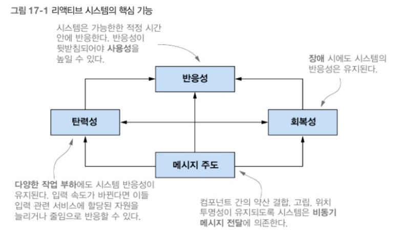
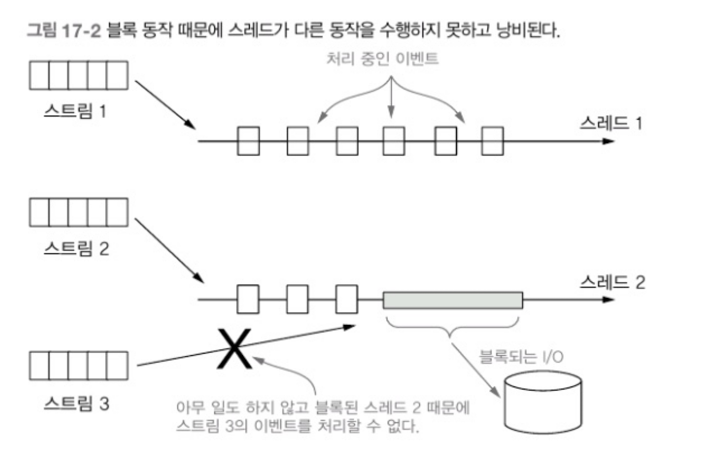

# 17. 리액티브 프로그래밍
## 1. 리액티브 매니패스토
1. 반응성(responsive) : 리액티 시스템을 빠를 뿐 아니라 더 중요한 특징으로 일정하고 예상할 수 있는 반응 시간을 제공.
결과적으로 사용자가 기대치를 가질 수 있다.
기대치를 통해 사용자의 확신이 증가하면서 사용할 수 있는 어플리케이션이라는 확인을 제공 가능.
2. 회복성(resilient) : 장애가 발생해도 시스템은 반응해야 한다. 
컴포넌트 실행 복제, 여러 컴포넌트의 시간(발송자와 수신자가 독립적인 생명주기를 가짐)과 
공간(발송자와 수신자가 다른 프로세스에서 실행됨) 분리, 각 컴포넌트가 비동기적으로 작업을 다른 컴포넌트에 위임하는 등 리액티브 매니페스토는 회복성을 달성할 수 있는 다양한 기법을 제시.
3. 탄력성(elastic) : 어플리케이션의 생명주기 동안 다양한 작업 부하를 받게 되는데, 이 다양한 작업 부하로 애플리케이션의 반응성이 위협받을 수 있다.
리액티브 시스템에선 무거운 작업 부하가 발생하면 자동으로 관련 컴포넌트에 할당된 자원 수를 늘린다.
4. 메시지 주도(Message-driven) : 회복성과 탄력성을 지원하려면 약한 결합, 고립, 위치 투명성 등을 지원할 수 있도록 시스템을 구성하는 컴포넌트의 경계를 명확하게 정의해야 한다.
비동기 메시지를 전달해 컴포넌트 끼리의 통신이 이뤄진다. 이 덕분에 회복성(장애를 메시지로 처리)과 탄력성(주고 받은 메시지의 수를 감시하고 메시지의 양에 따라 적절하게 리소스를 할당)을 얻을 수 있다.

### 1.1 어플리케이션 수준의 리액티브
이벤트 스트림을 블록하지 않고 비동기로 처리하는 것이 최신 멀티코어 CPU의 사용률을 극대화(내부적으로 경쟁하는 CPU의 스레드 사용률)할 수 있는 방법.
이 목표 달성을 위해 리엑티브 프레임워크와 라이브러리는 스레드(상대적으로 비싸고 희귀한 자원)를 퓨처, 엑터, 일련의 콜백을 발생시키는 이벤트 루프 등과 공유하고 처리할 이벤트를 변환하고 관리.

스레드보다 가벼울 뿐 아니라, 이들 기술을 이용함으로 동시, 비동기 애플리케이션 구현의 추상 수준을 높일 수 있으므로 동기 블록, 경쟁 조건, 데드락 같은 저 수준의 멀티스레드 문제를 직접 처리할 필요가 없어지면서 비즈니스 요구사항을 구현하는 데 집중할 수 있다.

스레드풀 2개에 스트림 3개가 돈다면, 아래와 같은 비효율적인 상황이 발생할수 있다.

### 1.2 시스템 수준의 리액티브
리액티브 시스템 : 여러 어플리케이션이 한 개의 일관적인, 회복할 수 있는 플랫폼을 구성할 수 있게 해줄 뿐 아니라 이들 어플리케이션 중 하나가 실패해도 전체 시스템은 계속 운영될 수 있도록 도와주는 소프트웨어 아키텍처.
